# StudyBridge Architecture Deep Dive

## 📋 Table of Contents

1. [Clean Architecture Implementation](#clean-architecture-implementation)
2. [Modular Monolith Structure](#modular-monolith-structure)
3. [CQRS Pattern](#cqrs-pattern)
4. [Domain-Driven Design](#domain-driven-design)
5. [Dynamic API-Driven Frontend](#dynamic-api-driven-frontend)
6. [Role-Based Access Control (RBAC)](#role-based-access-control-rbac)
7. [Dependency Injection](#dependency-injection)
8. [Data Access Patterns](#data-access-patterns)
9. [Cross-Cutting Concerns](#cross-cutting-concerns)
10. [Scalability Considerations](#scalability-considerations)

---

## 🏗️ Clean Architecture Implementation

StudyBridge implements Clean Architecture with clear separation of concerns across four main layers:

### Architecture Layers

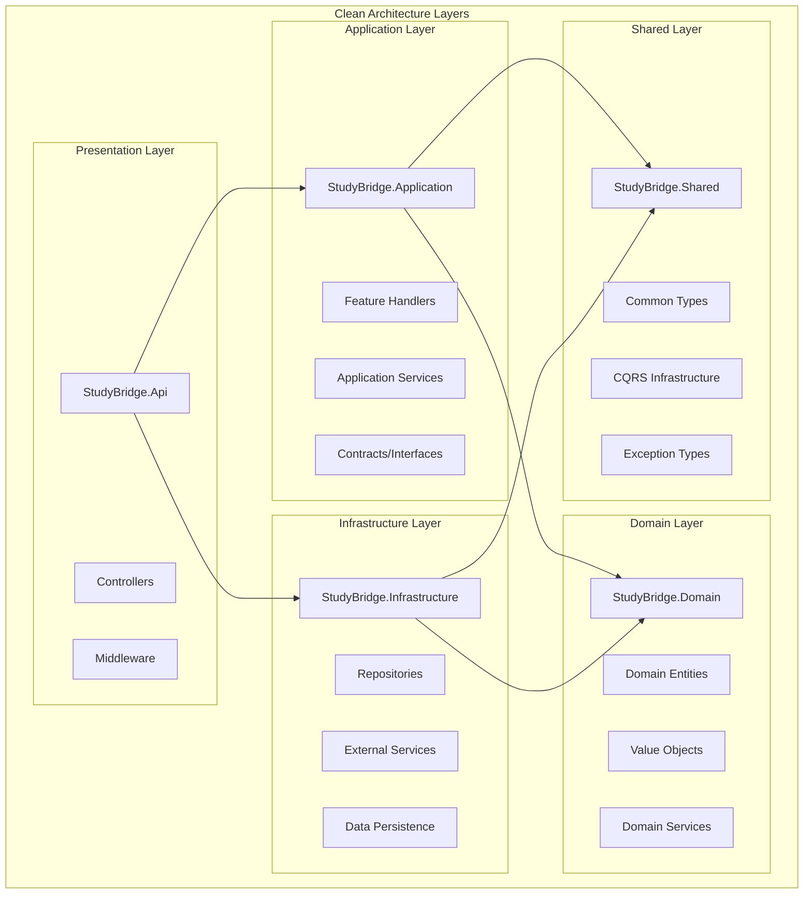

### Dependency Rules

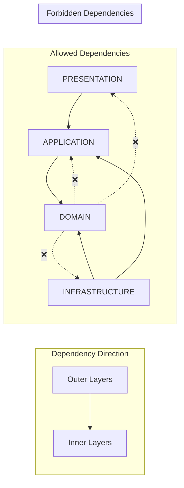

### Benefits of This Architecture

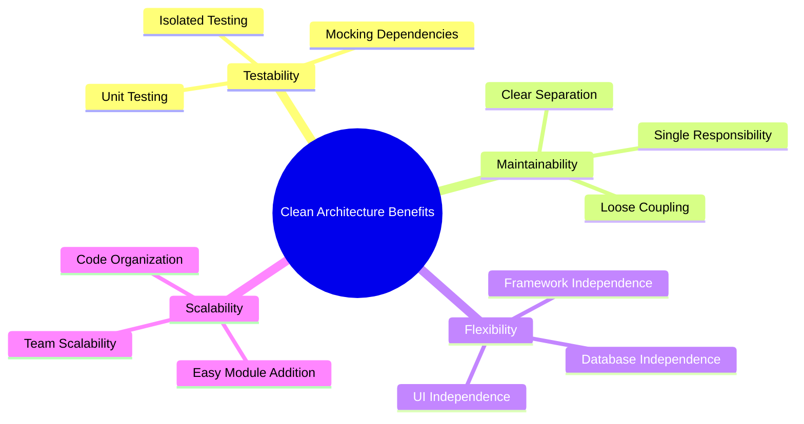

---

## 🧩 Modular Monolith Structure

StudyBridge is designed as a modular monolith, providing the benefits of modular architecture while maintaining deployment simplicity.

### Module Structure

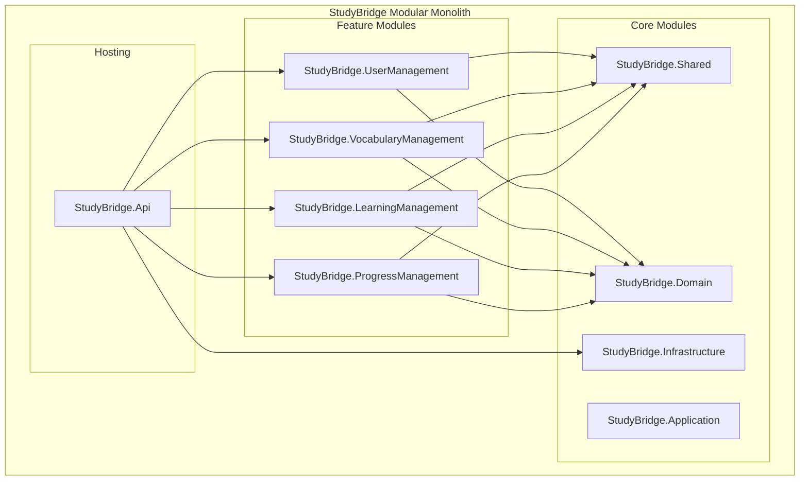

### Module Communication

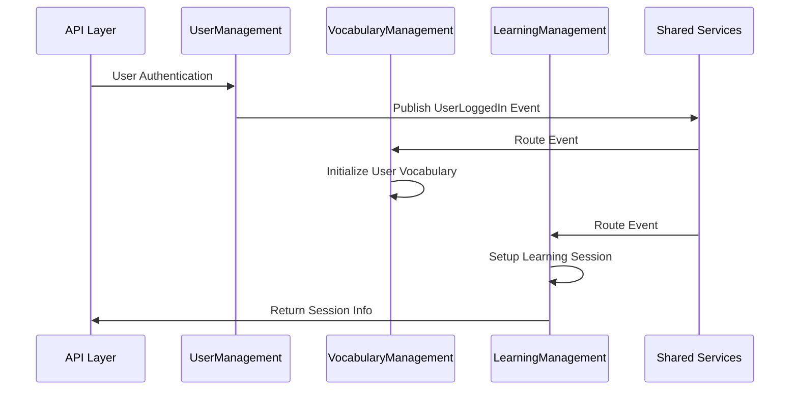

### Module Boundaries

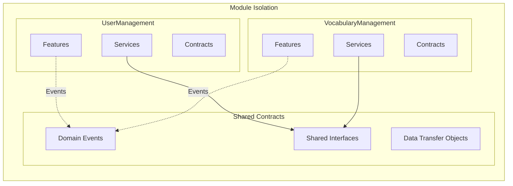

---

## ⚡ CQRS Pattern

StudyBridge implements a custom CQRS (Command Query Responsibility Segregation) pattern without external dependencies.

### CQRS Architecture

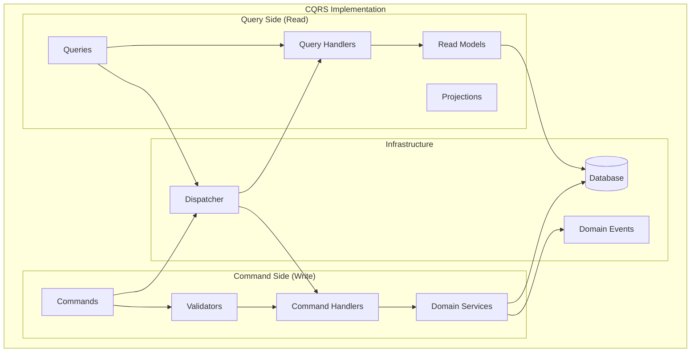

### CQRS Interfaces

```csharp
// Command Pattern
public interface ICommand<TResponse> { }

public interface ICommandHandler<TCommand, TResponse>
    where TCommand : ICommand<TResponse>
{
    Task<TResponse> HandleAsync(TCommand command, CancellationToken cancellationToken);
}

// Query Pattern
public interface IQuery<TResponse> { }

public interface IQueryHandler<TQuery, TResponse>
    where TQuery : IQuery<TResponse>
{
    Task<TResponse> HandleAsync(TQuery query, CancellationToken cancellationToken);
}

// Dispatcher
public interface IDispatcher
{
    Task<TResponse> DispatchAsync<TResponse>(ICommand<TResponse> command, CancellationToken cancellationToken = default);
    Task<TResponse> DispatchAsync<TResponse>(IQuery<TResponse> query, CancellationToken cancellationToken = default);
}
```

### Feature Implementation Pattern

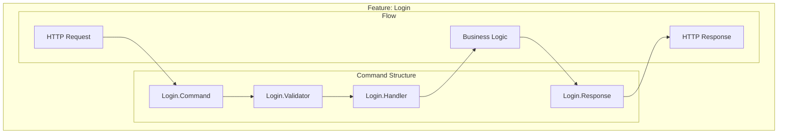

---

## 🎯 Domain-Driven Design

StudyBridge applies DDD principles to model the complex vocabulary learning domain.

### Domain Model

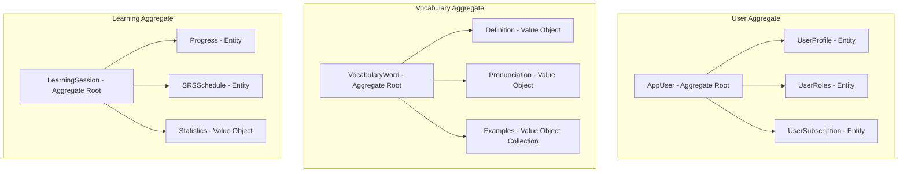

### Aggregate Design Principles

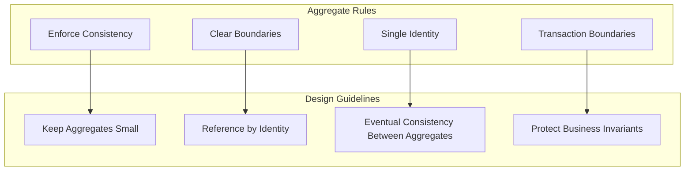

### Domain Events

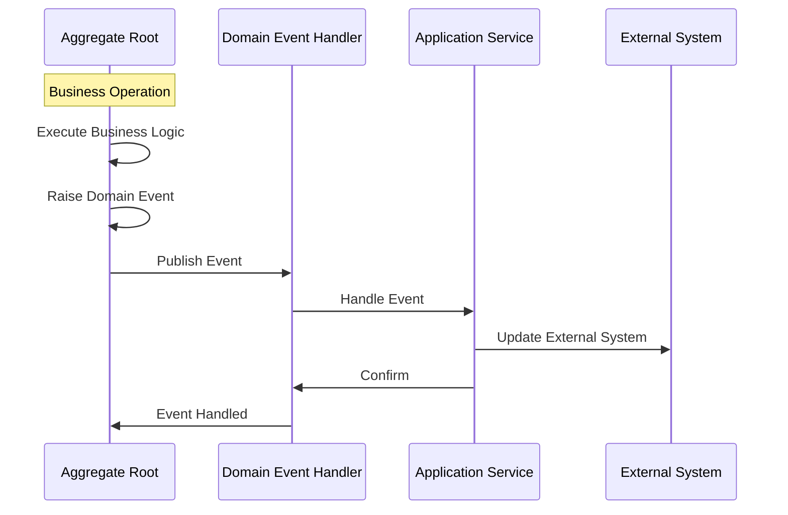

---

## 🌐 Dynamic API-Driven Frontend

StudyBridge frontend is designed to be completely dynamic and API-driven, eliminating hardcoded configurations and making the system adaptable to backend changes.

### Frontend Architecture

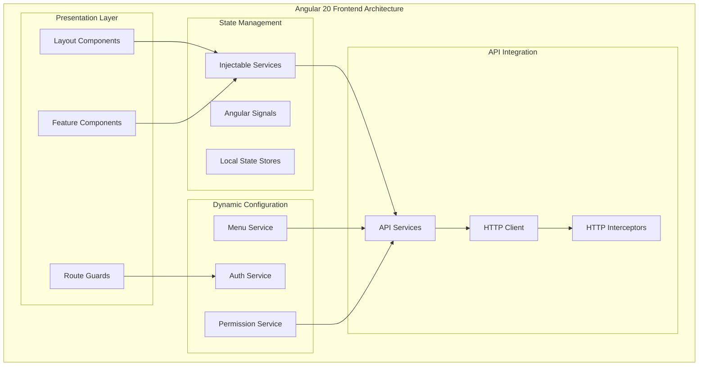

### Dynamic Menu System

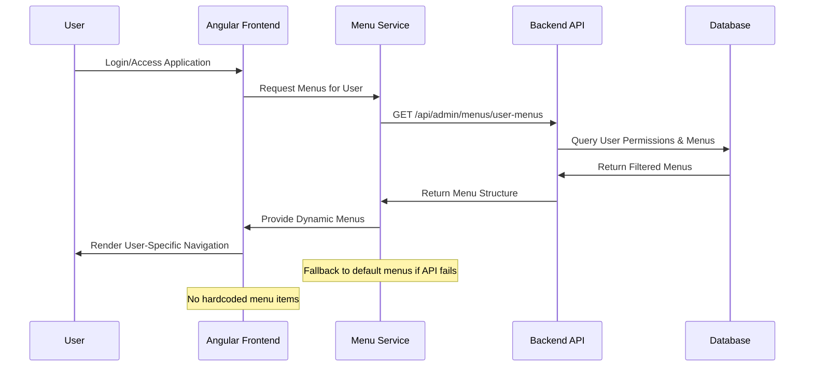

### Role-Based Layout Selection

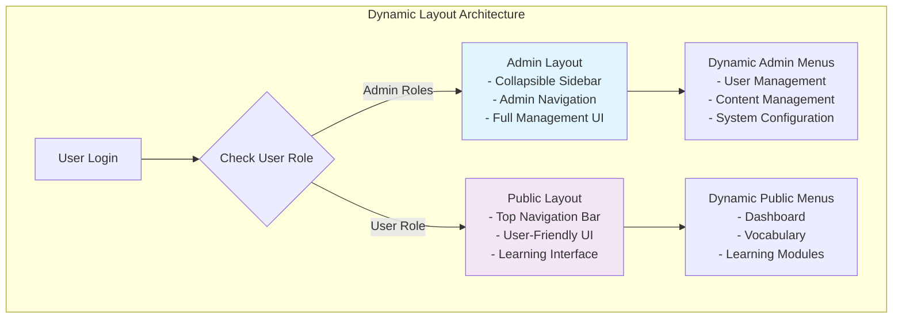

### API-Driven Configuration

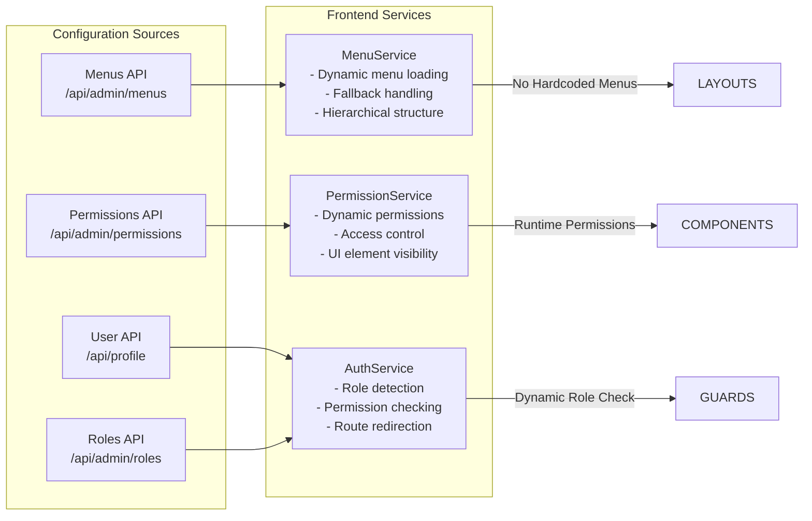

---

## 🛡️ Role-Based Access Control (RBAC)

StudyBridge implements a simplified menu-based RBAC system that dynamically controls access to features and data based on user roles and their associated menus.

### Simplified RBAC Architecture

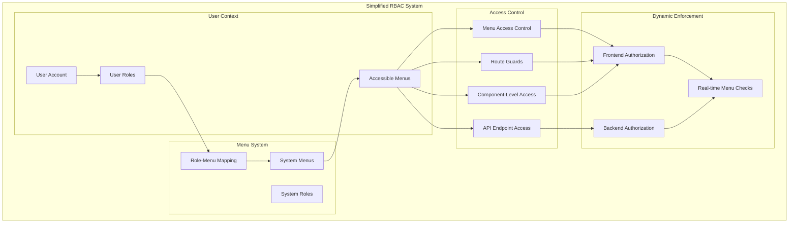

### Dynamic Menu Access Evaluation

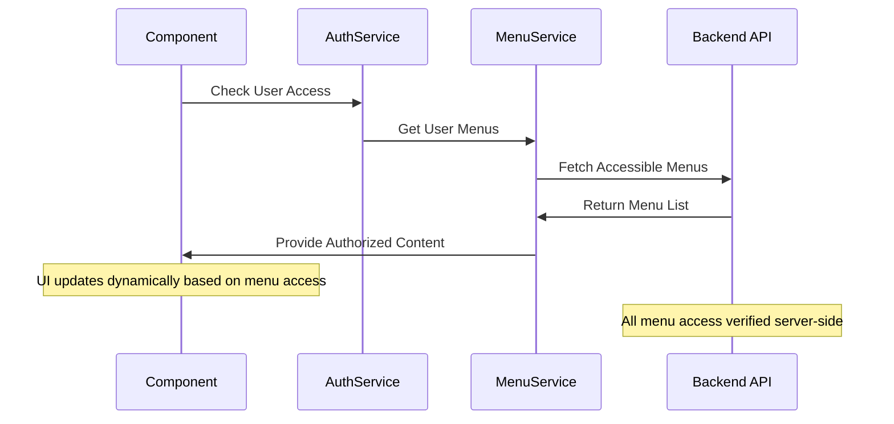

### Role-Based Menu Filtering

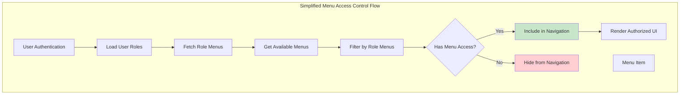

### System Roles and Menu Access

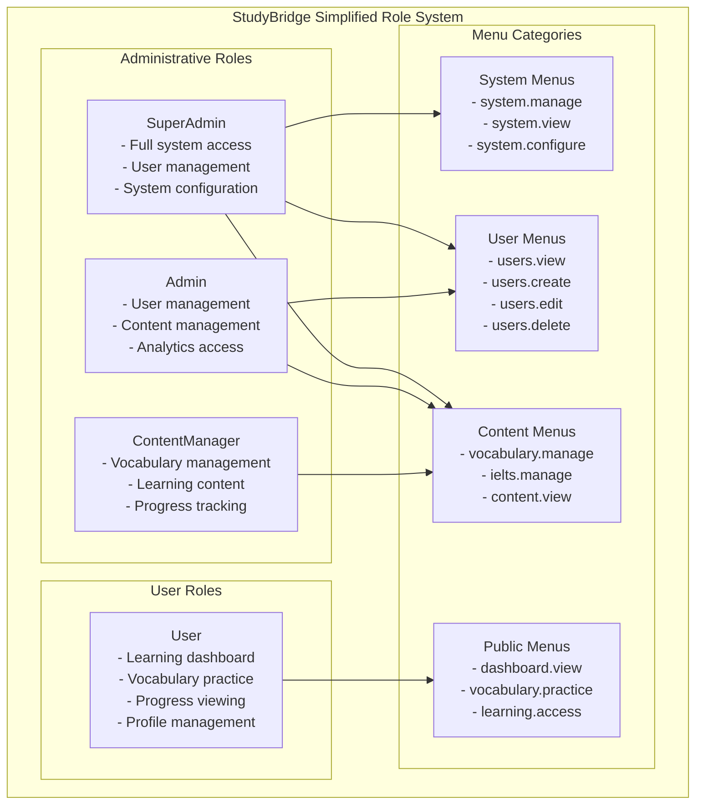

---

## 💉 Dependency Injection

StudyBridge uses .NET's built-in DI container with custom service registration patterns.

### Service Registration Strategy

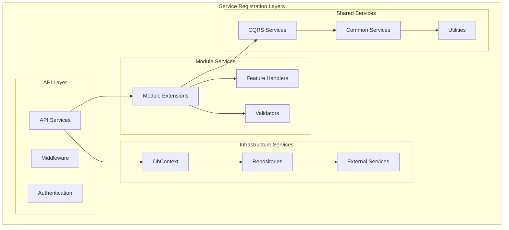

### Service Lifetime Management

```mermaid
graph LR
    subgraph "Service Lifetimes"
        SINGLETON[Singleton]
        SCOPED[Scoped]
        TRANSIENT[Transient]
    end
    
    subgraph "Singleton Services"
        CONFIG[Configuration]
        LOGGING[Logging]
        CACHE[Caching]
    end
    
    subgraph "Scoped Services"
        DBCONTEXT[DbContext]
        HANDLERS[Handlers]
        SERVICES[Application Services]
    end
    
    subgraph "Transient Services"
        VALIDATORS[Validators]
        HELPERS[Helper Classes]
        FACTORIES[Factories]
    end
    
    SINGLETON --> CONFIG
    SINGLETON --> LOGGING
    SINGLETON --> CACHE
    
    SCOPED --> DBCONTEXT
    SCOPED --> HANDLERS
    SCOPED --> SERVICES
    
    TRANSIENT --> VALIDATORS
    TRANSIENT --> HELPERS
    TRANSIENT --> FACTORIES
```

---

## 📊 Data Access Patterns

### Repository Pattern Implementation

```mermaid
graph TB
    subgraph "Data Access Layer"
        subgraph "Abstractions"
            IAPPDB[IApplicationDbContext]
            IREPO[IRepository&lt;T&gt;]
            IUNITOFWORK[IUnitOfWork]
        end
        
        subgraph "Implementations"
            APPDB[AppDbContext]
            GENERIC_REPO[GenericRepository&lt;T&gt;]
            SPECIFIC_REPOS[Specific Repositories]
        end
        
        subgraph "Entity Framework"
            DBSETS[DbSets]
            MIGRATIONS[Migrations]
            CONFIGURATIONS[Entity Configurations]
        end
    end
    
    IAPPDB --> APPDB
    IREPO --> GENERIC_REPO
    IREPO --> SPECIFIC_REPOS
    APPDB --> DBSETS
    APPDB --> CONFIGURATIONS
    DBSETS --> MIGRATIONS
```

### Entity Configuration Pattern

```mermaid
graph TB
    subgraph "Entity Framework Configuration"
        subgraph "Base Configuration"
            BASE_ENTITY[BaseEntity Config]
            AUDIT_ENTITY[BaseAuditableEntity Config]
        end
        
        subgraph "Specific Configurations"
            USER_CONFIG[AppUser Configuration]
            PROFILE_CONFIG[UserProfile Configuration]
            ROLE_CONFIG[Role Configuration]
        end
        
        subgraph "Configuration Features"
            RELATIONSHIPS[Relationships]
            CONSTRAINTS[Constraints]
            INDEXES[Indexes]
            CONVERSIONS[Value Conversions]
        end
    end
    
    BASE_ENTITY --> USER_CONFIG
    BASE_ENTITY --> PROFILE_CONFIG
    AUDIT_ENTITY --> ROLE_CONFIG
    
    USER_CONFIG --> RELATIONSHIPS
    USER_CONFIG --> CONSTRAINTS
    PROFILE_CONFIG --> INDEXES
    ROLE_CONFIG --> CONVERSIONS
```

### Query Optimization Patterns

```mermaid
graph LR
    subgraph "Query Strategies"
        PROJECTION[Select Projections]
        FILTERING[Where Filtering]
        INCLUDES[Include Related Data]
        SPLITTING[Split Queries]
    end
    
    subgraph "Performance Techniques"
        ASYNC[Async Operations]
        TRACKING[No Tracking Queries]
        COMPILED[Compiled Queries]
        BULK[Bulk Operations]
    end
    
    PROJECTION --> ASYNC
    FILTERING --> TRACKING
    INCLUDES --> COMPILED
    SPLITTING --> BULK
```

---

## 🔧 Cross-Cutting Concerns

### Logging Strategy

```mermaid
graph TB
    subgraph "Logging Architecture"
        subgraph "Logging Levels"
            TRACE[Trace - Detailed Debug]
            DEBUG[Debug - Development Info]
            INFO[Information - General Flow]
            WARN[Warning - Unexpected Events]
            ERROR[Error - Failures]
            CRITICAL[Critical - App Crashes]
        end
        
        subgraph "Logging Targets"
            CONSOLE[Console Output]
            FILES[Rolling Files]
            STRUCTURED[Structured Logging]
            EXTERNAL[External Services]
        end
        
        subgraph "Serilog Configuration"
            ENRICHERS[Context Enrichers]
            FILTERS[Log Filters]
            SINKS[Output Sinks]
        end
    end
    
    TRACE --> CONSOLE
    DEBUG --> CONSOLE
    INFO --> FILES
    WARN --> FILES
    ERROR --> STRUCTURED
    CRITICAL --> EXTERNAL
    
    ENRICHERS --> SINKS
    FILTERS --> SINKS
```

### Exception Handling Strategy

```mermaid
graph TB
    subgraph "Exception Handling Flow"
        EXCEPTION[Exception Thrown]
        GLOBAL_HANDLER[Global Exception Handler]
        LOGGER[Exception Logger]
        MAPPER[Status Code Mapper]
        RESPONSE[Error Response]
        CLIENT[Client Response]
    end
    
    subgraph "Exception Types"
        VALIDATION[ValidationException → 400]
        NOTFOUND[NotFoundException → 404]
        UNAUTHORIZED[UnauthorizedException → 401]
        FORBIDDEN[ForbiddenException → 403]
        CONFLICT[ConflictException → 409]
        BUSINESS[BusinessLogicException → 422]
        SYSTEM[SystemException → 500]
    end
    
    EXCEPTION --> GLOBAL_HANDLER
    GLOBAL_HANDLER --> LOGGER
    GLOBAL_HANDLER --> MAPPER
    MAPPER --> RESPONSE
    RESPONSE --> CLIENT
    
    VALIDATION --> MAPPER
    NOTFOUND --> MAPPER
    UNAUTHORIZED --> MAPPER
    FORBIDDEN --> MAPPER
    CONFLICT --> MAPPER
    BUSINESS --> MAPPER
    SYSTEM --> MAPPER
```

### Security Implementation

```mermaid
graph TB
    subgraph "Security Layers"
        subgraph "Authentication"
            JWT[JWT Tokens]
            GOOGLE[Google OAuth]
            LOCAL[Local Authentication]
        end
        
        subgraph "Authorization"
            ROLES[Role-Based Access]
            PERMISSIONS[Permission-Based Access]
            POLICIES[Custom Policies]
        end
        
        subgraph "Data Protection"
            HASHING[Password Hashing]
            ENCRYPTION[Data Encryption]
            SANITIZATION[Input Sanitization]
        end
        
        subgraph "Security Headers"
            CORS[CORS Configuration]
            HTTPS[HTTPS Enforcement]
            HEADERS[Security Headers]
        end
    end
    
    JWT --> ROLES
    GOOGLE --> ROLES
    LOCAL --> HASHING
    ROLES --> PERMISSIONS
    PERMISSIONS --> POLICIES
    HASHING --> ENCRYPTION
    ENCRYPTION --> SANITIZATION
    POLICIES --> CORS
    CORS --> HTTPS
    HTTPS --> HEADERS
```

---

## 📈 Scalability Considerations

### Horizontal Scaling Preparation

```mermaid
graph TB
    subgraph "Scalability Strategies"
        subgraph "Current Architecture"
            MONOLITH[Modular Monolith]
            SHARED_DB[Shared Database]
            STATELESS[Stateless Services]
        end
        
        subgraph "Future Microservices"
            USER_SVC[User Service]
            VOCAB_SVC[Vocabulary Service]
            LEARNING_SVC[Learning Service]
            PROGRESS_SVC[Progress Service]
        end
        
        subgraph "Data Strategy"
            DB_PER_SERVICE[Database per Service]
            EVENT_SOURCING[Event Sourcing]
            CQRS_SEPARATION[CQRS Read/Write Split]
        end
    end
    
    MONOLITH --> USER_SVC
    MONOLITH --> VOCAB_SVC
    MONOLITH --> LEARNING_SVC
    MONOLITH --> PROGRESS_SVC
    
    USER_SVC --> DB_PER_SERVICE
    VOCAB_SVC --> EVENT_SOURCING
    LEARNING_SVC --> CQRS_SEPARATION
```

### Performance Optimization Patterns

```mermaid
graph LR
    subgraph "Performance Strategies"
        subgraph "Caching"
            MEMORY[Memory Cache]
            DISTRIBUTED[Distributed Cache]
            CDN[CDN Caching]
        end
        
        subgraph "Database"
            INDEXING[Database Indexing]
            QUERY_OPT[Query Optimization]
            CONNECTION_POOL[Connection Pooling]
        end
        
        subgraph "Application"
            ASYNC[Async Programming]
            BULK_OPS[Bulk Operations]
            LAZY_LOADING[Lazy Loading]
        end
    end
    
    MEMORY --> INDEXING
    DISTRIBUTED --> QUERY_OPT
    CDN --> CONNECTION_POOL
    INDEXING --> ASYNC
    QUERY_OPT --> BULK_OPS
    CONNECTION_POOL --> LAZY_LOADING
```

### Monitoring & Observability

```mermaid
graph TB
    subgraph "Observability Stack"
        subgraph "Metrics"
            APP_METRICS[Application Metrics]
            PERF_COUNTERS[Performance Counters]
            CUSTOM_METRICS[Custom Metrics]
        end
        
        subgraph "Logging"
            STRUCTURED_LOGS[Structured Logging]
            CORRELATION[Correlation IDs]
            LOG_AGGREGATION[Log Aggregation]
        end
        
        subgraph "Tracing"
            DISTRIBUTED_TRACING[Distributed Tracing]
            REQUEST_TRACKING[Request Tracking]
            DEPENDENCY_TRACKING[Dependency Tracking]
        end
        
        subgraph "Health Checks"
            APP_HEALTH[Application Health]
            DB_HEALTH[Database Health]
            EXTERNAL_HEALTH[External Service Health]
        end
    end
    
    APP_METRICS --> STRUCTURED_LOGS
    PERF_COUNTERS --> CORRELATION
    CUSTOM_METRICS --> LOG_AGGREGATION
    
    STRUCTURED_LOGS --> DISTRIBUTED_TRACING
    CORRELATION --> REQUEST_TRACKING
    LOG_AGGREGATION --> DEPENDENCY_TRACKING
    
    DISTRIBUTED_TRACING --> APP_HEALTH
    REQUEST_TRACKING --> DB_HEALTH
    DEPENDENCY_TRACKING --> EXTERNAL_HEALTH
```

---

---

## 📝 Implementation Notes

### Recent Updates (September 2025)

**Dynamic API Integration Completed:**
- ✅ Removed all hardcoded admin roles from `AuthService`
- ✅ Replaced hardcoded permissions mapping with API-driven approach
- ✅ Cleaned up hardcoded menu items in layout components
- ✅ Implemented fallback mechanisms for graceful API failure handling
- ✅ Added proper role-based layout selection (Admin vs User)
- ✅ Enhanced MenuService with dynamic loading capabilities

**Key Changes Made:**
1. **AuthService Improvements:**
   - `hasAdminRole()`: Now dynamically determines admin roles instead of hardcoded list
   - `isAdminUser()`: Uses API-provided role data for authorization decisions
   - Removed hardcoded role arrays: `['Admin', 'SuperAdmin', 'Administrator', ...]`

2. **Layout Components:**
   - **AdminLayoutComponent**: Uses `MenuService.loadAdminMenus()` for dynamic navigation
   - **PublicLayoutComponent**: Integrated with `MenuService.loadPublicMenus()` 
   - Fallback menus provide minimal navigation when API is unavailable

3. **Menu System:**
   - **MenuService**: Enhanced with hierarchical menu building and permission filtering
   - Backend integration via `/api/admin/menus/user-menus` and `/api/admin/public-menus`
   - Automatic fallback to default menus if API calls fail

4. **Security & Permissions:**
   - Dynamic permission checking based on API responses
   - Real-time role validation without hardcoded assumptions
   - Graceful handling of missing permissions data

**Migration Path for Microservices:**
The current implementation is designed to easily transition from the modular monolith to microservices:
- Service abstractions allow easy extraction to separate APIs
- Event-driven communication patterns already implemented  
- Database per service preparation through module boundaries
- CQRS foundation supports distributed query/command handling

---

*This architecture documentation provides deep insights into StudyBridge's technical implementation and design decisions. It serves as a guide for developers working on the system and for future architectural evolution.*
