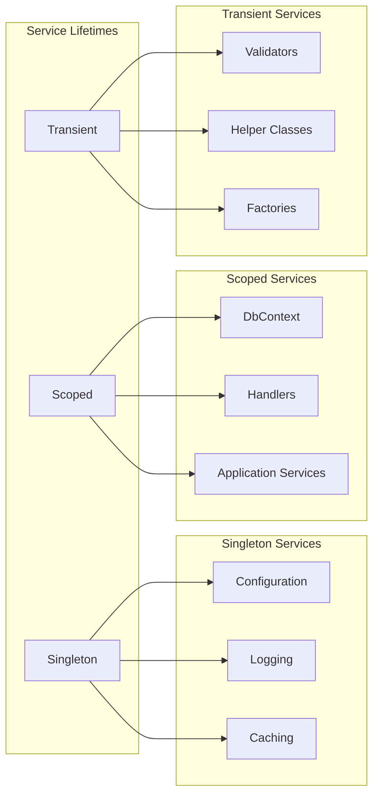
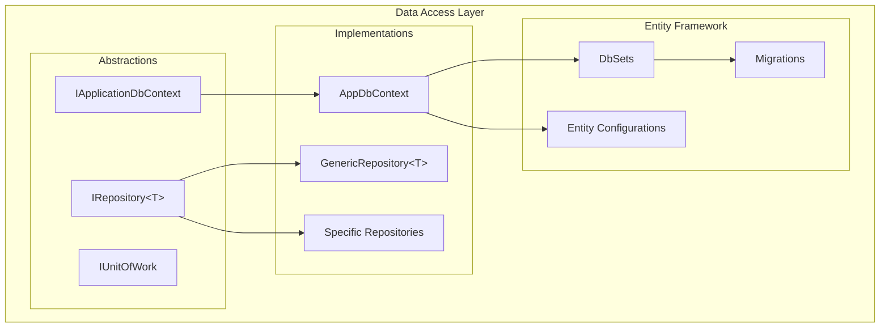
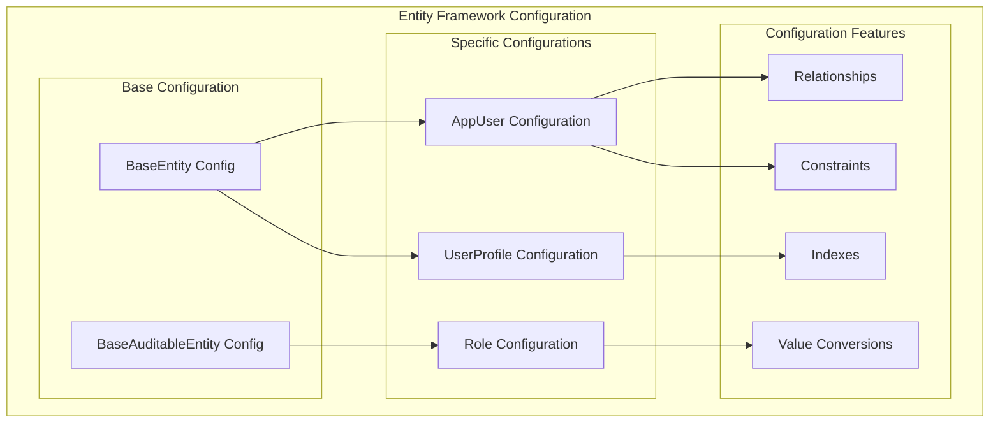
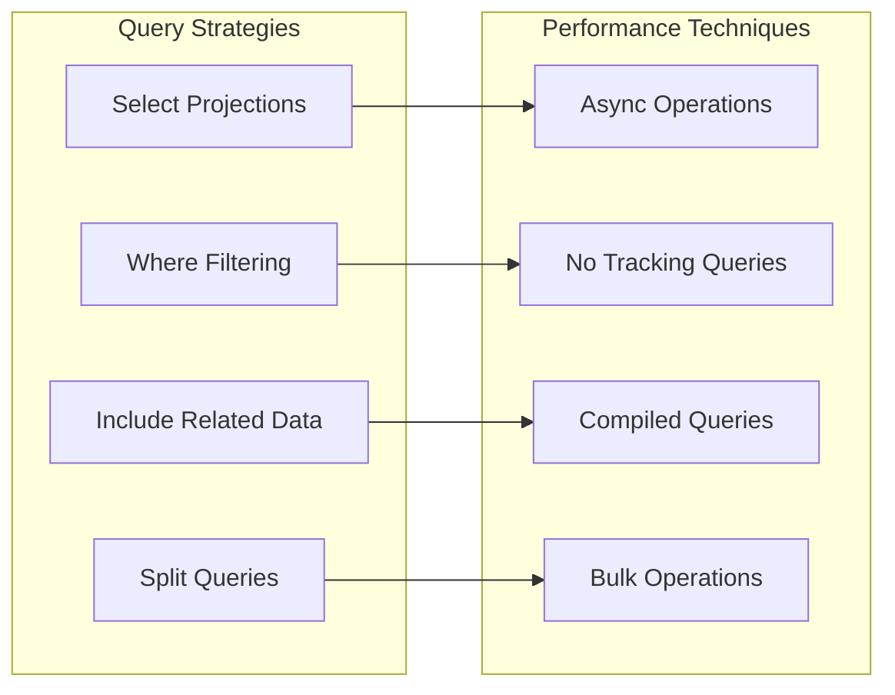
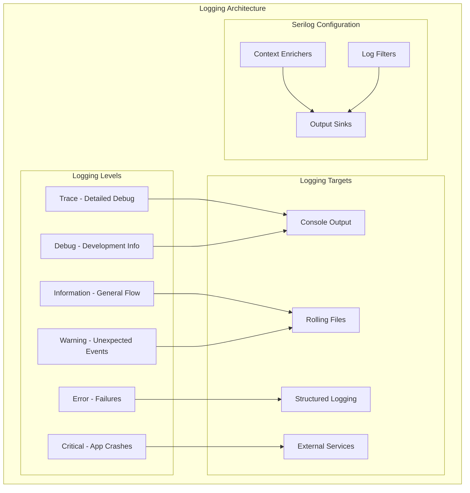
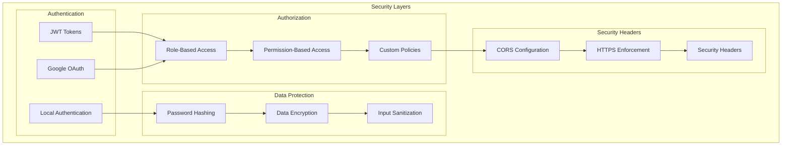
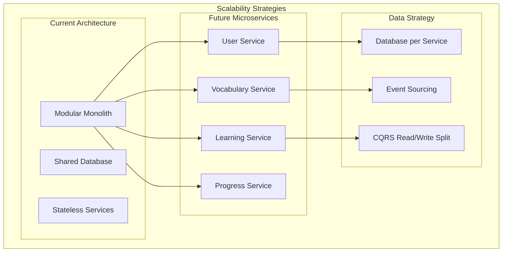

# StudyBridge Architecture Deep Dive

## 📋 Table of Contents

1. [Clean Architecture Implementation](#clean-architecture-implementation)
2. [Modular Monolith Structure](#modular-monolith-structure)
3. [CQRS Pattern](#cqrs-pattern)
4. [Domain-Driven Design](#domain-driven-design)
5. [Dependency Injection](#dependency-injection)
6. [Data Access Patterns](#data-access-patterns)
7. [Cross-Cutting Concerns](#cross-cutting-concerns)
8. [Scalability Considerations](#scalability-considerations)

---

## 🏗️ Clean Architecture Implementation

StudyBridge implements Clean Architecture with clear separation of concerns across four main layers:

### Architecture Layers


### Dependency Rules

```mermaid
flowchart LR
    subgraph "Dependency Direction"
        OUTER[Outer Layers] --> INNER[Inner Layers]
    end
    
    subgraph "Allowed Dependencies"
        PRESENTATION --> APPLICATION
        APPLICATION --> DOMAIN
        INFRASTRUCTURE --> DOMAIN
        INFRASTRUCTURE --> APPLICATION
    end
    
    subgraph "Forbidden Dependencies"
        DOMAIN -.->|❌| APPLICATION
        DOMAIN -.->|❌| INFRASTRUCTURE
        DOMAIN -.->|❌| PRESENTATION
    end
```



### Benefits of This Architecture


---

## 🧩 Modular Monolith Structure

StudyBridge is designed as a modular monolith, providing the benefits of modular architecture while maintaining deployment simplicity.

### Module Structure


### Module Communication


### Module Boundaries


---

## ⚡ CQRS Pattern

StudyBridge implements a custom CQRS (Command Query Responsibility Segregation) pattern without external dependencies.

### CQRS Architecture


### CQRS Interfaces

```csharp
// Command Pattern
public interface ICommand<TResponse> { }

public interface ICommandHandler<TCommand, TResponse>
    where TCommand : ICommand<TResponse>
{
    Task<TResponse> HandleAsync(TCommand command, CancellationToken cancellationToken);
}

// Query Pattern
public interface IQuery<TResponse> { }

public interface IQueryHandler<TQuery, TResponse>
    where TQuery : IQuery<TResponse>
{
    Task<TResponse> HandleAsync(TQuery query, CancellationToken cancellationToken);
}

// Dispatcher
public interface IDispatcher
{
    Task<TResponse> DispatchAsync<TResponse>(ICommand<TResponse> command, CancellationToken cancellationToken = default);
    Task<TResponse> DispatchAsync<TResponse>(IQuery<TResponse> query, CancellationToken cancellationToken = default);
}
```

### Feature Implementation Pattern


---

## 🎯 Domain-Driven Design

StudyBridge applies DDD principles to model the complex vocabulary learning domain.

### Domain Model


### Aggregate Design Principles


### Domain Events


---

## 💉 Dependency Injection

StudyBridge uses .NET's built-in DI container with custom service registration patterns.

### Service Registration Strategy


### Service Lifetime Management



---

## 📊 Data Access Patterns

### Repository Pattern Implementation



### Entity Configuration Pattern



### Query Optimization Patterns



---

## 🔧 Cross-Cutting Concerns

### Logging Strategy



### Exception Handling Strategy

```mermaid
graph TB
    subgraph "Exception Handling Flow"
        EXCEPTION[Exception Thrown]
        GLOBAL_HANDLER[Global Exception Handler]
        LOGGER[Exception Logger]
        MAPPER[Status Code Mapper]
        RESPONSE[Error Response]
        CLIENT[Client Response]
    end
    
    subgraph "Exception Types"
        VALIDATION[ValidationException → 400]
        NOTFOUND[NotFoundException → 404]
        UNAUTHORIZED[UnauthorizedException → 401]
        FORBIDDEN[ForbiddenException → 403]
        CONFLICT[ConflictException → 409]
        BUSINESS[BusinessLogicException → 422]
        SYSTEM[SystemException → 500]
    end
    
    EXCEPTION --> GLOBAL_HANDLER
    GLOBAL_HANDLER --> LOGGER
    GLOBAL_HANDLER --> MAPPER
    MAPPER --> RESPONSE
    RESPONSE --> CLIENT
    
    VALIDATION --> MAPPER
    NOTFOUND --> MAPPER
    UNAUTHORIZED --> MAPPER
    FORBIDDEN --> MAPPER
    CONFLICT --> MAPPER
    BUSINESS --> MAPPER
    SYSTEM --> MAPPER
```



### Security Implementation



---

## 📈 Scalability Considerations

### Horizontal Scaling Preparation



### Performance Optimization Patterns

```mermaid
graph LR
    subgraph "Performance Strategies"
        subgraph "Caching"
            MEMORY[Memory Cache]
            DISTRIBUTED[Distributed Cache]
            CDN[CDN Caching]
        end
        
        subgraph "Database"
            INDEXING[Database Indexing]
            QUERY_OPT[Query Optimization]
            CONNECTION_POOL[Connection Pooling]
        end
        
        subgraph "Application"
            ASYNC[Async Programming]
            BULK_OPS[Bulk Operations]
            LAZY_LOADING[Lazy Loading]
        end
    end
    
    MEMORY --> INDEXING
    DISTRIBUTED --> QUERY_OPT
    CDN --> CONNECTION_POOL
    INDEXING --> ASYNC
    QUERY_OPT --> BULK_OPS
    CONNECTION_POOL --> LAZY_LOADING
```

### Monitoring & Observability

```mermaid
graph TB
    subgraph "Observability Stack"
        subgraph "Metrics"
            APP_METRICS[Application Metrics]
            PERF_COUNTERS[Performance Counters]
            CUSTOM_METRICS[Custom Metrics]
        end
        
        subgraph "Logging"
            STRUCTURED_LOGS[Structured Logging]
            CORRELATION[Correlation IDs]
            LOG_AGGREGATION[Log Aggregation]
        end
        
        subgraph "Tracing"
            DISTRIBUTED_TRACING[Distributed Tracing]
            REQUEST_TRACKING[Request Tracking]
            DEPENDENCY_TRACKING[Dependency Tracking]
        end
        
        subgraph "Health Checks"
            APP_HEALTH[Application Health]
            DB_HEALTH[Database Health]
            EXTERNAL_HEALTH[External Service Health]
        end
    end
    
    APP_METRICS --> STRUCTURED_LOGS
    PERF_COUNTERS --> CORRELATION
    CUSTOM_METRICS --> LOG_AGGREGATION
    
    STRUCTURED_LOGS --> DISTRIBUTED_TRACING
    CORRELATION --> REQUEST_TRACKING
    LOG_AGGREGATION --> DEPENDENCY_TRACKING
    
    DISTRIBUTED_TRACING --> APP_HEALTH
    REQUEST_TRACKING --> DB_HEALTH
    DEPENDENCY_TRACKING --> EXTERNAL_HEALTH
```

---

*This architecture documentation provides deep insights into StudyBridge's technical implementation and design decisions. It serves as a guide for developers working on the system and for future architectural evolution.*
