# StudyBridge Development Guide

## 📋 Table of Contents

1. [Getting Started](#getting-started)
2. [Development Environment Setup](#development-environment-setup)
3. [Code Standards & Guidelines](#code-standards--guidelines)
4. [Feature Development Workflow](#feature-development-workflow)
5. [Testing Guidelines](#testing-guidelines)
6. [Git Workflow](#git-workflow)
7. [Deployment Process](#deployment-process)
8. [Troubleshooting](#troubleshooting)

---

## 🚀 Getting Started

### Prerequisites


### Quick Start

```bash
# Clone repository
git clone https://github.com/mdabdullahfaruque/StudyBridgeBD.git
cd StudyBridgeBD

# Backend setup
cd StudyBridge
dotnet restore
dotnet build

# Frontend setup
cd ../Client/Web/studybridge-web
npm install

# Start development servers
# Terminal 1: Backend
cd StudyBridge/StudyBridge.Api
dotnet run

# Terminal 2: Frontend
cd Client/Web/studybridge-web
ng serve
```

### Project Structure Overview


---

## 🛠️ Development Environment Setup

### Backend Configuration

#### 1. Database Setup

```sql
-- Create PostgreSQL database
CREATE DATABASE studybridge_dev;
CREATE USER studybridge_user WITH PASSWORD 'your_password';
GRANT ALL PRIVILEGES ON DATABASE studybridge_dev TO studybridge_user;
```

#### 2. appsettings.Development.json

```json
{
  "ConnectionStrings": {
    "DefaultConnection": "Host=localhost;Database=studybridge_dev;Username=studybridge_user;Password=your_password"
  },
  "JWT": {
    "SecretKey": "your-super-secret-jwt-key-here-min-32-chars",
    "Issuer": "StudyBridge",
    "Audience": "StudyBridge-Users",
    "ExpiryInDays": 7
  },
  "GoogleAuth": {
    "ClientId": "your-google-client-id.apps.googleusercontent.com"
  },
  "Logging": {
    "LogLevel": {
      "Default": "Information",
      "Microsoft.AspNetCore": "Warning",
      "Microsoft.EntityFrameworkCore": "Information"
    }
  }
}
```

#### 3. Run Migrations

```bash
cd StudyBridge/StudyBridge.Api
dotnet ef database update
```

### Frontend Configuration

#### 1. Environment Files

**src/environments/environment.development.ts:**
```typescript
export const environment = {
  production: false,
  apiUrl: 'http://localhost:5000/api/v1',
  googleClientId: 'your-google-client-id.apps.googleusercontent.com'
};
```

#### 2. Google OAuth Setup

Add to **src/index.html:**
```html
<script src="https://accounts.google.com/gsi/client" async defer></script>
```

### IDE Configuration

#### VS Code Extensions


#### VS Code Settings (.vscode/settings.json)

```json
{
  "editor.formatOnSave": true,
  "editor.codeActionsOnSave": {
    "source.fixAll.eslint": true
  },
  "csharp.format.enable": true,
  "omnisharp.enableRoslynAnalyzers": true,
  "angular.experimental-ivy": true,
  "typescript.preferences.importModuleSpecifier": "relative"
}
```

---

## 📏 Code Standards & Guidelines

### C# Coding Standards

#### Naming Conventions

```mermaid
graph TB
    subgraph "Naming Standards"
        subgraph "Classes & Interfaces"
            CLASS[PascalCase - UserService]
            INTERFACE[PascalCase with 'I' - IUserService]
            ABSTRACT[PascalCase with 'Base' - BaseEntity]
        end
        
        subgraph "Methods & Properties"
            PUBLIC[PascalCase - GetUserById()]
            PRIVATE[camelCase - _userRepository]
            CONST[UPPER_SNAKE_CASE - MAX_RETRY_COUNT]
        end
        
        subgraph "Variables & Parameters"
            LOCAL[camelCase - userId]
            PARAM[camelCase - emailAddress]
            FIELD[camelCase with '_' - _dbContext]
        end
    end
```

#### Code Structure Example

```csharp
// ✅ Good Example
public class UserService : IUserService
{
    private readonly IUserRepository _userRepository;
    private readonly ILogger<UserService> _logger;
    private const int MAX_LOGIN_ATTEMPTS = 3;

    public UserService(
        IUserRepository userRepository,
        ILogger<UserService> logger)
    {
        _userRepository = userRepository ?? throw new ArgumentNullException(nameof(userRepository));
        _logger = logger ?? throw new ArgumentNullException(nameof(logger));
    }

    public async Task<User> GetUserByIdAsync(Guid userId, CancellationToken cancellationToken = default)
    {
        if (userId == Guid.Empty)
            throw new ArgumentException("User ID cannot be empty", nameof(userId));

        _logger.LogInformation("Retrieving user with ID: {UserId}", userId);
        
        var user = await _userRepository.GetByIdAsync(userId, cancellationToken);
        
        if (user == null)
        {
            _logger.LogWarning("User not found with ID: {UserId}", userId);
            throw new NotFoundException($"User with ID {userId} not found");
        }

        return user;
    }
}
```

### TypeScript/Angular Standards

#### File Structure


#### TypeScript Example

```typescript
// ✅ Good Example
export interface User {
  id: string;
  email: string;
  displayName: string;
  roles: string[];
}

@Injectable({
  providedIn: 'root'
})
export class AuthService {
  private readonly apiUrl = environment.apiUrl;
  private currentUserSubject = new BehaviorSubject<User | null>(null);
  
  public currentUser$ = this.currentUserSubject.asObservable();

  constructor(
    private http: HttpClient,
    private router: Router
  ) {
    this.initializeUser();
  }

  public async login(credentials: LoginRequest): Promise<LoginResponse> {
    try {
      const response = await this.http.post<ApiResponse<LoginResponse>>(
        `${this.apiUrl}/auth/login`,
        credentials
      ).toPromise();

      if (response?.data) {
        this.setCurrentUser(response.data);
        return response.data;
      }
      
      throw new Error('Invalid response format');
    } catch (error) {
      this.handleError('Login failed', error);
      throw error;
    }
  }

  private setCurrentUser(loginResponse: LoginResponse): void {
    localStorage.setItem('token', loginResponse.token);
    this.currentUserSubject.next({
      id: loginResponse.userId,
      email: loginResponse.email,
      displayName: loginResponse.displayName,
      roles: loginResponse.roles
    });
  }

  private handleError(message: string, error: any): void {
    console.error(message, error);
    // Additional error handling logic
  }
}
```

---

## 🔄 Feature Development Workflow

### CQRS Feature Development


### Step-by-Step Feature Implementation

#### 1. Define Domain Entity

```csharp
// StudyBridge.Domain/Entities/VocabularyWord.cs
public class VocabularyWord : BaseAuditableEntity
{
    public string Word { get; set; } = string.Empty;
    public string Definition { get; set; } = string.Empty;
    public string Pronunciation { get; set; } = string.Empty;
    public DifficultyLevel Difficulty { get; set; }
    public WordCategory Category { get; set; }
    public List<string> Examples { get; set; } = new();
}
```

#### 2. Create Feature Command

```csharp
// Modules/StudyBridge.VocabularyManagement/Features/CreateWord.cs
public static class CreateWord
{
    public class Command : ICommand<Response>
    {
        public string Word { get; init; } = string.Empty;
        public string Definition { get; init; } = string.Empty;
        public string Pronunciation { get; init; } = string.Empty;
        public DifficultyLevel Difficulty { get; init; }
        public WordCategory Category { get; init; }
        public List<string> Examples { get; init; } = new();
    }

    public class Validator : AbstractValidator<Command>
    {
        public Validator()
        {
            RuleFor(x => x.Word)
                .NotEmpty().WithMessage("Word is required")
                .MaximumLength(100).WithMessage("Word cannot exceed 100 characters");

            RuleFor(x => x.Definition)
                .NotEmpty().WithMessage("Definition is required")
                .MaximumLength(500).WithMessage("Definition cannot exceed 500 characters");
        }
    }

    public class Response
    {
        public Guid Id { get; init; }
        public string Word { get; init; } = string.Empty;
        public string Definition { get; init; } = string.Empty;
    }

    public class Handler(
        IApplicationDbContext context,
        ILogger<Handler> logger) : ICommandHandler<Command, Response>
    {
        public async Task<Response> HandleAsync(Command command, CancellationToken cancellationToken)
        {
            var vocabularyWord = new VocabularyWord
            {
                Word = command.Word,
                Definition = command.Definition,
                Pronunciation = command.Pronunciation,
                Difficulty = command.Difficulty,
                Category = command.Category,
                Examples = command.Examples
            };

            context.VocabularyWords.Add(vocabularyWord);
            await context.SaveChangesAsync(cancellationToken);

            logger.LogInformation("Vocabulary word created: {Word}", command.Word);

            return new Response
            {
                Id = vocabularyWord.Id,
                Word = vocabularyWord.Word,
                Definition = vocabularyWord.Definition
            };
        }
    }
}
```

#### 3. Create API Controller

```csharp
// StudyBridge.Api/Controllers/VocabularyController.cs
[ApiController]
[Route("api/v1/vocabulary")]
[Authorize]
public class VocabularyController : BaseController
{
    [HttpPost]
    [RequireMenu("vocabulary.create")]
    public async Task<ActionResult<ApiResponse<CreateWord.Response>>> CreateWord(
        [FromBody] CreateWord.Command command,
        CancellationToken cancellationToken)
    {
        var result = await Dispatcher.DispatchAsync(command, cancellationToken);
        return Ok(ApiResponse.Success(result, "Vocabulary word created successfully"));
    }
}
```

#### 4. Write Unit Tests

```csharp
// StudyBridge.Tests.Unit/VocabularyManagement/CreateWordTests.cs
public class CreateWordTests
{
    private readonly Mock<IApplicationDbContext> _mockContext;
    private readonly Mock<ILogger<CreateWord.Handler>> _mockLogger;
    private readonly CreateWord.Handler _handler;

    public CreateWordTests()
    {
        _mockContext = new Mock<IApplicationDbContext>();
        _mockLogger = new Mock<ILogger<CreateWord.Handler>>();
        _handler = new CreateWord.Handler(_mockContext.Object, _mockLogger.Object);
    }

    [Fact]
    public async Task HandleAsync_WithValidCommand_ShouldCreateVocabularyWord()
    {
        // Arrange
        var command = new CreateWord.Command
        {
            Word = "Eloquent",
            Definition = "Fluent or persuasive in speaking or writing",
            Pronunciation = "/ˈeləkwənt/",
            Difficulty = DifficultyLevel.Intermediate,
            Category = WordCategory.Adjective
        };

        var mockDbSet = DbContextMockHelper.CreateMockDbSet<VocabularyWord>();
        _mockContext.Setup(x => x.VocabularyWords).Returns(mockDbSet.Object);

        // Act
        var result = await _handler.HandleAsync(command, CancellationToken.None);

        // Assert
        result.Should().NotBeNull();
        result.Word.Should().Be(command.Word);
        result.Definition.Should().Be(command.Definition);
        mockDbSet.Verify(x => x.Add(It.IsAny<VocabularyWord>()), Times.Once);
        _mockContext.Verify(x => x.SaveChangesAsync(It.IsAny<CancellationToken>()), Times.Once);
    }
}
```

---

## 🧪 Testing Guidelines

### Testing Strategy


### Test Naming Convention

```csharp
// Pattern: MethodName_StateUnderTest_ExpectedBehavior
[Fact]
public async Task HandleAsync_WithValidCommand_ShouldReturnSuccessResponse()

[Fact]
public async Task HandleAsync_WithInvalidEmail_ShouldThrowValidationException()

[Fact]
public async Task HandleAsync_WithNonExistentUser_ShouldThrowNotFoundException()
```

### Test Data Builders

```csharp
public class AppUserBuilder
{
    private AppUser _user = new AppUser
    {
        Id = Guid.NewGuid(),
        Email = "test@example.com",
        DisplayName = "Test User",
        IsActive = true,
        EmailConfirmed = true
    };

    public AppUserBuilder WithEmail(string email)
    {
        _user.Email = email;
        return this;
    }

    public AppUserBuilder WithDisplayName(string displayName)
    {
        _user.DisplayName = displayName;
        return this;
    }

    public AppUserBuilder AsInactive()
    {
        _user.IsActive = false;
        return this;
    }

    public AppUser Build() => _user;
}

// Usage in tests
var user = new AppUserBuilder()
    .WithEmail("john@example.com")
    .WithDisplayName("John Doe")
    .Build();
```

---

## 🔧 Git Workflow

### Branching Strategy

```mermaid
gitgraph
    commit id: "Initial"
    branch develop
    checkout develop
    commit id: "Setup"
    
    branch feature/user-auth
    checkout feature/user-auth
    commit id: "Auth logic"
    commit id: "Tests"
    checkout develop
    merge feature/user-auth
    
    branch feature/vocabulary
    checkout feature/vocabulary
    commit id: "Vocab entities"
    commit id: "CRUD operations"
    checkout develop
    merge feature/vocabulary
    
    checkout main
    merge develop
    commit id: "Release v1.0"
```

### Commit Message Format

```
type(scope): description

[optional body]

[optional footer]
```

#### Types:
- **feat**: New feature
- **fix**: Bug fix
- **docs**: Documentation changes
- **style**: Code style changes (formatting, etc.)
- **refactor**: Code refactoring
- **test**: Adding or updating tests
- **chore**: Maintenance tasks

#### Examples:
```
feat(auth): add Google OAuth integration

- Implement Google OAuth flow
- Add JWT token generation
- Update user entity for OAuth support

Closes #123
```

```
fix(api): resolve user profile update validation

- Fix email validation in profile update
- Add proper error handling for duplicate emails
- Update unit tests

Fixes #456
```

### Pull Request Template

```markdown
## Description
Brief description of changes

## Type of Change
- [ ] Bug fix
- [ ] New feature
- [ ] Breaking change
- [ ] Documentation update

## Testing
- [ ] Unit tests pass
- [ ] Integration tests pass
- [ ] Manual testing completed

## Checklist
- [ ] Code follows style guidelines
- [ ] Self-review completed
- [ ] Comments added for complex logic
- [ ] Documentation updated
- [ ] No breaking changes (or documented)
```

---

## 🚀 Deployment Process

### Environment Pipeline


### Deployment Checklist

#### Pre-Deployment
- [ ] All tests passing
- [ ] Code review completed
- [ ] Database migrations reviewed
- [ ] Configuration updated
- [ ] Documentation updated

#### Backend Deployment
```bash
# Build and publish
dotnet publish -c Release -o ./publish

# Run database migrations
dotnet ef database update --project StudyBridge.Infrastructure --startup-project StudyBridge.Api

# Deploy to server
# (Specific deployment steps depend on hosting platform)
```

#### Frontend Deployment
```bash
# Build for production
ng build --configuration production

# Deploy to web server
# (Copy dist/ folder to web server)
```

#### Post-Deployment
- [ ] Health checks passing
- [ ] Critical user flows tested
- [ ] Performance monitoring active
- [ ] Error logging verified

---

## 🔍 Troubleshooting

### Common Issues

#### Database Connection Issues

```mermaid
flowchart TD
    DB_ERROR[Database Connection Error] --> CHECK_CONNECTION[Check Connection String]
    CHECK_CONNECTION --> CHECK_SERVICE[Check PostgreSQL Service]
    CHECK_SERVICE --> CHECK_FIREWALL[Check Firewall/Network]
    CHECK_FIREWALL --> CHECK_CREDENTIALS[Verify Credentials]
    CHECK_CREDENTIALS --> MIGRATION[Run Migrations]
    MIGRATION --> SUCCESS[✅ Resolved]
```



**Symptoms:**
- Application fails to start
- "Cannot connect to database" errors

**Solutions:**
1. Verify PostgreSQL is running
2. Check connection string in appsettings.json
3. Ensure database exists
4. Run migrations: `dotnet ef database update`

#### JWT Token Issues

**Symptoms:**
- 401 Unauthorized errors
- "Invalid token" messages

**Solutions:**
1. Check JWT secret key configuration
2. Verify token expiration
3. Ensure proper Bearer token format
4. Check CORS configuration

#### Angular Build Issues

**Symptoms:**
- Build failures
- Module not found errors

**Solutions:**
1. Clear node_modules: `rm -rf node_modules && npm install`
2. Clear Angular cache: `ng cache clean`
3. Check TypeScript compatibility
4. Verify environment configuration

### Debug Configuration

#### VS Code launch.json

```json
{
  "version": "0.2.0",
  "configurations": [
    {
      "name": ".NET Core Launch (web)",
      "type": "coreclr",
      "request": "launch",
      "preLaunchTask": "build",
      "program": "${workspaceFolder}/StudyBridge/StudyBridge.Api/bin/Debug/net8.0/StudyBridge.Api.dll",
      "args": [],
      "cwd": "${workspaceFolder}/StudyBridge/StudyBridge.Api",
      "stopAtEntry": false,
      "serverReadyAction": {
        "action": "openExternally",
        "pattern": "\\bNow listening on:\\s+(https?://\\S+)"
      },
      "env": {
        "ASPNETCORE_ENVIRONMENT": "Development"
      }
    }
  ]
}
```

### Performance Monitoring

#### Key Metrics to Monitor


---

*This development guide provides comprehensive instructions for working with the StudyBridge codebase. Keep it updated as the project evolves and new patterns emerge.*
