# 🚀 StudyBridge Implementation Status (September 2025)

## 📋 Table of Contents

1. [Current Implementation Overview](#current-implementation-overview)
2. [Backend (.NET 8) Status](#backend-net-8-status)
3. [Frontend (Angular 20) Status](#frontend-angular-20-status)
4. [Authentication & Security](#authentication--security)
5. [Testing Implementation](#testing-implementation)
6. [Configuration Management](#configuration-management)
7. [Recent Enhancements](#recent-enhancements)
8. [Next Development Phase](#next-development-phase)

---

## 🎯 Current Implementation Overview

StudyBridge has successfully implemented a complete authentication system with both backend API and frontend user interface. The project demonstrates modern web development practices with clean architecture and comprehensive testing.

### Implementation Highlights

```mermaid
graph TB
    subgraph "Backend Implementation ✅"
        API[.NET 8 Web API]
        AUTH_API[Authentication Module]
        CQRS[CQRS Pattern]
        TESTS[258 Unit Tests]
        CONFIG[Secure Configuration]
    end
    
    subgraph "Frontend Implementation ✅"
        ANGULAR[Angular 20 App]
        AUTH_UI[Auth Components]
        DASHBOARD[Dashboard UI]
        RESPONSIVE[Responsive Design]
        FORMS[Reactive Forms]
    end
    
    subgraph "Integration ✅"
        JWT[JWT Authentication]
        OAUTH[Google OAuth 2.0]
        API_CLIENT[HTTP Client Services]
        ROUTING[Protected Routes]
        STATE[State Management]
    end
    
    API --> AUTH_API
    AUTH_API --> CQRS
    CQRS --> TESTS
    
    ANGULAR --> AUTH_UI
    AUTH_UI --> DASHBOARD
    DASHBOARD --> RESPONSIVE
    
    AUTH_API --> JWT
    JWT --> OAUTH
    AUTH_UI --> API_CLIENT
    API_CLIENT --> ROUTING
```



---

## 🔧 Backend (.NET 8) Status

### ✅ Completed Features

#### User Management Module
- **Registration**: Complete user registration with validation
- **Login**: Email/password authentication with JWT
- **Google OAuth**: Social authentication integration
- **Password Management**: Secure password change functionality
- **Profile Management**: User profile CRUD operations

#### Architecture Implementation
- **Clean Architecture**: Proper layer separation
- **CQRS Pattern**: Command/Query responsibility segregation
- **Modular Design**: Pluggable module architecture
- **Repository Pattern**: Data access abstraction
- **Dependency Injection**: IoC container setup

#### API Endpoints (8 Implemented)
```mermaid
graph LR
    subgraph "Authentication API"
        A1[POST /auth/login]
        A2[POST /auth/register]
        A3[POST /auth/google]
        A4[POST /auth/change-password]
    end
    
    subgraph "Profile API"
        P1[GET /profile]
        P2[PUT /profile]
    end
    
    subgraph "Admin API"
        AD1[GET /admin/users]
        AD2[DELETE /admin/users/{id}]
    end
```

#### Security Implementation
- **JWT Authentication**: Secure token-based auth
- **Password Hashing**: ASP.NET Core Identity integration
- **Input Validation**: FluentValidation implementation
- **CORS Configuration**: Frontend integration support
- **Secure Configuration**: Environment-based secrets

### 🧪 Testing Coverage
- **Total Tests**: 258 (all passing ✅)
- **Business Logic Coverage**: 92.2%
- **Testing Frameworks**: xUnit, Moq, FluentAssertions
- **Test Categories**:
  - Unit Tests: Authentication handlers, services
  - Integration Tests: API endpoints
  - Repository Tests: Data access layer

---

## 🎨 Frontend (Angular 20) Status

### ✅ Completed Features

#### Authentication Components
```typescript
// Modern Angular 20 implementation with standalone components
@Component({
  selector: 'app-login',
  standalone: true,
  imports: [CommonModule, ReactiveFormsModule, ButtonComponent],
  templateUrl: './login.html',
  styleUrl: './login.scss'
})
export class LoginComponent {
  // Reactive form implementation with validation
  // Google OAuth integration
  // Error handling and notifications
}
```

#### Component Architecture
- **Login Component**: Email/password + Google OAuth
- **Register Component**: User registration with validation
- **Dashboard Component**: User profile display and navigation
- **Profile Component**: User profile management
- **Header Component**: Navigation and user menu

#### UI/UX Implementation
- **Tailwind CSS**: Modern utility-first styling
- **Responsive Design**: Mobile-first approach
- **Form Validation**: Real-time input validation
- **Loading States**: User feedback during operations
- **Toast Notifications**: Success/error messaging
- **Protected Routes**: Authentication guards

#### Service Layer
```typescript
// AuthService with RxJS observables
@Injectable({ providedIn: 'root' })
export class AuthService {
  currentUser$: Observable<User | null>;
  isAuthenticated$: Observable<boolean>;
  
  login(credentials: LoginRequest): Observable<AuthResponse>
  register(userData: RegisterRequest): Observable<AuthResponse>
  googleLogin(token: string): Observable<AuthResponse>
  logout(): void
}
```

### 🔧 Technical Implementation

#### Modern Angular Features
- **Standalone Components**: No modules required
- **Signals**: Reactive state management (where applicable)
- **TypeScript 5.9**: Latest language features
- **RxJS 7.8**: Reactive programming patterns
- **Angular Router**: Navigation and guards

#### Project Structure
```
src/app/
├── features/
│   ├── auth/
│   │   ├── components/
│   │   │   ├── login/
│   │   │   └── register/
│   └── dashboard/
│       └── components/
├── shared/
│   ├── services/
│   ├── components/
│   └── models/
└── core/
    ├── guards/
    └── interceptors/
```

---

## 🔐 Authentication & Security

### Complete OAuth 2.0 Flow


### Security Features Implemented
- ✅ **JWT Token Management**: Secure token storage and refresh
- ✅ **Google OAuth 2.0**: Social authentication
- ✅ **Password Security**: ASP.NET Core Identity hashing
- ✅ **Input Validation**: Both frontend and backend
- ✅ **CORS Configuration**: Secure cross-origin requests
- ✅ **Environment Secrets**: Secure configuration management
- ✅ **Route Protection**: Authentication guards

---

## 🧪 Testing Implementation

### Backend Testing Strategy


### Recent Test Improvements
- **Fixed LoginHandlerTests**: Updated to use `IPasswordHasher<AppUser>`
- **Password Verification**: Proper ASP.NET Core Identity integration
- **Mock Configurations**: Improved test data builders
- **Null Reference Handling**: Enhanced null safety in tests

### Test Results (Latest Run)
```
Test summary: total: 258, failed: 0, succeeded: 258, skipped: 0
Duration: 6.8s
Coverage: 92.2% business logic
```

---

## ⚙️ Configuration Management

### Secure Configuration Pattern

```mermaid
graph LR
    subgraph "Configuration Files"
        BASE[appsettings.json<br/>📄 Placeholders only]
        DEV[appsettings.Development.json<br/>🔒 Real secrets - ignored by Git]
        EXAMPLE[appsettings.Example.json<br/>📋 Documentation template]
    end
    
    subgraph "Security Features"
        GITIGNORE[.gitignore<br/>🛡️ Excludes dev config]
        ENV_VARS[Environment Variables<br/>🔧 Production secrets]
        OAUTH[Google OAuth<br/>🔑 Client ID/Secret]
    end
    
    BASE --> DEV
    DEV --> GITIGNORE
    EXAMPLE --> ENV_VARS
```


### Configuration Security Implementation
- **GitHub Push Protection**: Prevented credentials from being committed
- **Environment-based Secrets**: Development vs Production separation
- **OAuth Configuration**: Secure Google Client ID/Secret management
- **Documentation**: Comprehensive setup guides

---

## 🆕 Recent Enhancements (September 2025)

### September 8, 2025
- **🔧 Fixed LoginHandlerTests**: Updated password hashing to use ASP.NET Core Identity
- **🔒 Secure Configuration**: Implemented comprehensive secrets management
- **📚 Documentation**: Added configuration security guide

### September 7, 2025
- **🎨 Enhanced Dashboard**: User greeting and profile display improvements
- **📱 Responsive Layout**: Mobile-optimized dashboard with Tailwind CSS
- **🧪 Test Coverage**: All 258 tests passing with 92.2% business logic coverage

### September 6, 2025
- **🔐 Authentication Components**: Complete login/register UI implementation
- **👤 Profile Management**: User profile forms with validation
- **🎯 Navigation**: Protected routes and authentication guards

### Key Technical Achievements
1. **Modern Architecture**: Angular 20 with standalone components
2. **Type Safety**: Comprehensive TypeScript implementation
3. **Reactive Programming**: RxJS for state management
4. **Security First**: Secure by default configuration
5. **Testing Excellence**: High test coverage with modern patterns

---

## 🚀 Next Development Phase

### Immediate Priorities (Q4 2025)
1. **Vocabulary Module**: Begin IELTS word management system
2. **Learning Engine**: Implement spaced repetition algorithm
3. **Progress Tracking**: User learning analytics
4. **Mobile Optimization**: Enhanced responsive design

### Technology Roadmap
- **Vocabulary Database**: 2,100+ categorized IELTS words
- **Learning Algorithm**: SRS (Spaced Repetition System)
- **Analytics**: Learning progress and streak tracking
- **PWA Features**: Offline capability and mobile app-like experience

---

## 📊 Current Technical Metrics

| Component | Status | Coverage | Notes |
|-----------|--------|----------|-------|
| Backend API | ✅ Complete | 92.2% | Production ready |
| Frontend UI | ✅ Complete | N/A | Modern Angular 20 |
| Authentication | ✅ Complete | 100% | Google OAuth + JWT |
| Testing | ✅ Complete | 92.2% | 258 tests passing |
| Documentation | ✅ Complete | N/A | Comprehensive guides |
| Security | ✅ Complete | 100% | Secure configuration |

---

## 🤝 Development Workflow

### GitHub Copilot Integration
This implementation status serves as comprehensive context for GitHub Copilot, providing:
- **Current Architecture**: Understanding of implemented patterns
- **Code Standards**: Established conventions and practices
- **Testing Approach**: Comprehensive testing strategies
- **Security Patterns**: Secure configuration management
- **Component Structure**: Modern Angular implementation

### For New Developers
1. **Start Here**: Read this implementation status
2. **Setup Environment**: Follow [DEVELOPMENT_GUIDE.md](./DEVELOPMENT_GUIDE.md)
3. **Understand Architecture**: Review [ARCHITECTURE.md](./ARCHITECTURE.md)
4. **API Reference**: Check [API_REFERENCE.md](./API_REFERENCE.md)
5. **Security Setup**: Read [CONFIGURATION_SECURITY.md](../CONFIGURATION_SECURITY.md)

---

*Implementation Status last updated: September 8, 2025*
*Next update scheduled: October 1, 2025*
