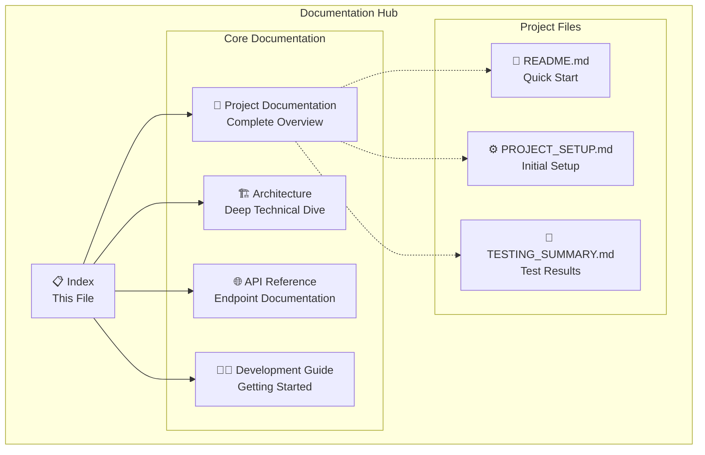
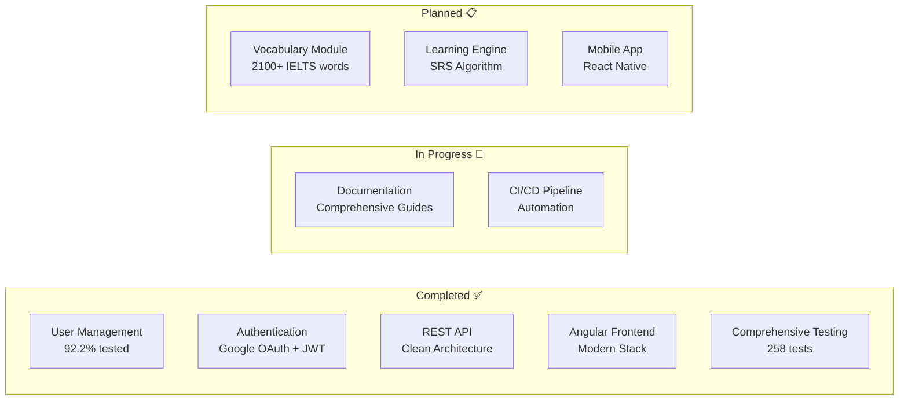

# StudyBridge Documentation Index

Welcome to the comprehensive documentation for the StudyBridge project - a modern IELTS vocabulary learning platform built with .NET 8 and Angular.

## 📚 Documentation Structure



---

## 🎯 Quick Navigation

### 📖 [Project Documentation](./PROJECT_DOCUMENTATION.md)
**Complete project overview with Mermaid diagrams**
- Project architecture and technology stack
- Domain model and entity relationships
- Application flow and CQRS implementation
- Module structure and future roadmap
- **Best for**: New team members, stakeholders, architects

### 🏗️ [Architecture Deep Dive](./ARCHITECTURE.md)
**Detailed technical architecture documentation**
- Clean Architecture implementation
- Modular monolith structure
- CQRS pattern with custom implementation
- Domain-driven design principles
- Scalability and performance considerations
- **Best for**: Senior developers, technical leads, system architects

### 🌐 [API Reference](./API_REFERENCE.md)
**Complete API endpoint documentation**
- Authentication and authorization endpoints
- Request/response patterns with examples
- Error handling and status codes
- JWT token structure and security
- **Best for**: Frontend developers, API consumers, testers

### 👨‍💻 [Development Guide](./DEVELOPMENT_GUIDE.md)
**Comprehensive developer onboarding**
- Environment setup and configuration
- Code standards and best practices
- Feature development workflow
- Testing guidelines and strategies
- Git workflow and deployment process
- **Best for**: Developers joining the project, daily development reference

---

## 🚀 Getting Started

### For New Developers
1. 📖 Start with [Project Documentation](./PROJECT_DOCUMENTATION.md) for overview
2. 👨‍💻 Follow [Development Guide](./DEVELOPMENT_GUIDE.md) for setup
3. 🌐 Reference [API Documentation](./API_REFERENCE.md) for endpoints
4. 🏗️ Dive into [Architecture](./ARCHITECTURE.md) for deep understanding

### For Project Managers
1. 📖 Read [Project Documentation](./PROJECT_DOCUMENTATION.md) sections:
   - Project Overview
   - Technology Stack
   - Future Roadmap
2. 🧪 Review [Testing Summary](../StudyBridge/TESTING_IMPLEMENTATION_SUMMARY.md)

### For System Architects
1. 🏗️ Study [Architecture Deep Dive](./ARCHITECTURE.md)
2. 📖 Review [Domain Model](./PROJECT_DOCUMENTATION.md#domain-model)
3. 🌐 Examine [API Structure](./API_REFERENCE.md)

---

## 📊 Project Status

### Current Implementation Status



### Key Metrics
- **Test Coverage**: 41% overall (92.2% business logic)
- **Total Tests**: 258 (all passing ✅)
- **Modules**: 1 complete (UserManagement), 3 planned
- **API Endpoints**: 8 implemented, documented
- **Documentation**: 4 comprehensive guides

---

## 🛠️ Technology Stack

### Backend
- **.NET 8** - Latest LTS framework
- **Entity Framework Core** - ORM with PostgreSQL
- **Custom CQRS** - Command/Query separation
- **FluentValidation** - Input validation
- **Serilog** - Structured logging
- **xUnit + Moq** - Testing framework

### Frontend
- **Angular 20+** - Latest with zoneless change detection
- **TypeScript** - Type-safe development
- **RxJS** - Reactive programming
- **Angular Material** - UI components (planned)

### Infrastructure
- **PostgreSQL** - Primary database
- **JWT** - Authentication tokens
- **Google OAuth** - Social authentication
- **Docker** - Containerization (planned)

---

## 📁 Project Structure

```
studybridgebd/
├── docs/                          # 📚 This documentation folder
│   ├── INDEX.md                   # 📋 This file
│   ├── PROJECT_DOCUMENTATION.md   # 📖 Complete overview
│   ├── ARCHITECTURE.md            # 🏗️ Technical deep dive
│   ├── API_REFERENCE.md           # 🌐 API documentation
│   └── DEVELOPMENT_GUIDE.md       # 👨‍💻 Developer guide
├── StudyBridge/                   # 🎯 Backend (.NET)
│   ├── StudyBridge.Api/           # API layer
│   ├── StudyBridge.Domain/        # Domain entities
│   ├── StudyBridge.Application/   # Application services
│   ├── StudyBridge.Infrastructure/# Infrastructure layer
│   ├── StudyBridge.Shared/        # Shared components
│   ├── Modules/                   # Feature modules
│   │   └── StudyBridge.UserManagement/
│   └── StudyBridge.Tests.Unit/    # Comprehensive tests
├── Client/                        # 🎨 Frontend
│   └── Web/
│       └── studybridge-web/       # Angular application
├── README.md                      # 📄 Quick start guide
└── PROJECT_SETUP.md               # ⚙️ Initial setup
```

---

## 🤝 Contributing

### For GitHub Copilot Context

This documentation folder serves as a comprehensive context source for GitHub Copilot. When working on the StudyBridge project:

1. **Reference these docs** for understanding project structure and patterns
2. **Follow established conventions** outlined in the Development Guide
3. **Maintain consistency** with the documented architecture
4. **Update documentation** when adding new features or making changes

### Documentation Maintenance

- **Update frequency**: After major features or architectural changes
- **Review process**: Include documentation updates in pull requests
- **Ownership**: Maintained by the development team
- **Format**: Markdown with Mermaid diagrams for visual clarity

---

## 🔄 Recent Updates

- **2024-03-14**: Complete documentation suite created
- **2024-03-14**: Mermaid diagrams added for visual clarity
- **2024-03-14**: Architecture patterns documented
- **2024-03-14**: API reference with examples completed
- **2024-03-14**: Development workflow established

---

## 📞 Support & Contact

For questions about this documentation or the StudyBridge project:

- **Repository**: [StudyBridgeBD](https://github.com/mdabdullahfaruque/StudyBridgeBD)
- **Issues**: Use GitHub Issues for bug reports and feature requests
- **Discussions**: Use GitHub Discussions for general questions

---

*This documentation is actively maintained and updated as the project evolves. Last updated: March 14, 2024*
