# StudyBridge Project Documentation

## 📋 Table of Contents

1. [Project Overview](#project-overview)
2. [Architecture Overview](#architecture-overview)
3. [Domain Model](#domain-model)
4. [Application Flow](#application-flow)
5. [Module Structure](#module-structure)
6. [Authentication & Authorization](#authentication--authorization)
7. [Data Layer](#data-layer)
8. [API Structure](#api-structure)
9. [Frontend Architecture](#frontend-architecture)
10. [Testing Strategy](#testing-strategy)
11. [Development Guidelines](#development-guidelines)
12. [Future Roadmap](#future-roadmap)

---

## 🎯 Project Overview

**StudyBridge** is a comprehensive IELTS vocabulary learning platform designed specifically for Bangladeshi students. The platform combines modern web technologies with proven learning methodologies to create an effective vocabulary acquisition system.

### Key Features
- 🔐 **Multi-Authentication Support**: Google OAuth + Traditional login
- 📚 **Vocabulary Management**: 2,100+ categorized IELTS words
- 🧠 **Spaced Repetition System (SRS)**: Scientific learning algorithms
- 📊 **Progress Tracking**: Detailed analytics and learning streaks
- 🎮 **Gamification**: Interactive learning experience
- 📱 **Responsive Design**: Works across all devices

### Technology Stack


---

## 🏗️ Architecture Overview

StudyBridge follows **Clean Architecture** principles with a **Modular Monolithic** approach, ensuring maintainability, testability, and scalability.

### High-Level Architecture


### CQRS Pattern Implementation


---

## 🎯 Domain Model

### Core Entities Relationship


### Domain Aggregates


---

## 🔄 Application Flow

### User Authentication Flow


### CQRS Command/Query Flow


### Error Handling Flow


---

## 📦 Module Structure

### UserManagement Module


### Feature Structure Pattern


---

## 🔐 Authentication & Authorization

### Authentication System


### Authorization Flow


### Role-Based Access Control


---

## 💾 Data Layer

### Database Schema


### Repository Pattern


---

## 🌐 API Structure

### API Versioning & Organization


### API Response Pattern


---

## 🎨 Frontend Architecture (Angular 20 Implementation)

### Current Application Structure (September 2025)


### Modern Angular 20 Features Implemented

```mermaid
graph LR
    subgraph "Angular 20 Features ✅"
        STANDALONE[Standalone Components<br/>No NgModules]
        SIGNALS[Reactive State<br/>RxJS + Observables]
        MODERN_FORMS[Reactive Forms<br/>Strong Typing]
        MODERN_ROUTING[Modern Router<br/>Guards & Resolvers]
    end
    
    subgraph "TypeScript 5.9 ✅"
        STRICT[Strict Mode<br/>Null Safety]
        DECORATORS[Modern Decorators<br/>Clean Syntax]
        TYPES[Strong Typing<br/>Interface Driven]
    end
    
    subgraph "Styling Solution ✅"
        TAILWIND[Tailwind CSS 3.4<br/>Utility-first]
        RESPONSIVE[Mobile-first<br/>Responsive Design]
        DARK_MODE[Dark Mode Ready<br/>CSS Variables]
    end
```



### Component Architecture (Implemented)

```typescript
// Example: Modern Standalone Component Implementation
@Component({
  selector: 'app-login',
  standalone: true,
  imports: [CommonModule, ReactiveFormsModule, ButtonComponent],
  templateUrl: './login.html',
  styleUrl: './login.scss'
})
export class LoginComponent implements OnInit, OnDestroy {
  private destroy$ = new Subject<void>();
  
  loginForm: FormGroup;
  isLoading = false;
  
  constructor(
    private authService: AuthService,
    private notificationService: NotificationService,
    private router: Router
  ) {
    this.loginForm = this.formBuilder.group({
      email: ['', [Validators.required, Validators.email]],
      password: ['', [Validators.required, Validators.minLength(6)]]
    });
  }
  
  onSubmit(): void {
    if (this.loginForm.valid) {
      this.authService.login(this.loginForm.value)
        .pipe(takeUntil(this.destroy$))
        .subscribe({
          next: (response) => this.handleLoginSuccess(response),
          error: (error) => this.handleLoginError(error)
        });
    }
  }
}
```

### State Management Flow (Implemented)


### Routing Implementation

```typescript
// Current routing configuration (implemented)
export const routes: Routes = [
  {
    path: '',
    redirectTo: '/dashboard',
    pathMatch: 'full'
  },
  {
    path: 'auth',
    children: [
      {
        path: 'login',
        component: LoginComponent
      },
      {
        path: 'register', 
        component: RegisterComponent
      }
    ]
  },
  {
    path: 'dashboard',
    component: DashboardHomeComponent,
    canActivate: [AuthGuard]
  },
  {
    path: 'profile',
    component: ProfileComponent,
    canActivate: [AuthGuard]
  }
];
```

### UI Component System (Tailwind CSS)

```mermaid
graph TB
    subgraph "Design System ✅"
        COLORS[Color Palette<br/>Primary, Secondary, etc.]
        TYPOGRAPHY[Typography Scale<br/>Headings, Body text]
        SPACING[Spacing System<br/>Consistent margins/padding]
        BREAKPOINTS[Responsive Breakpoints<br/>Mobile-first]
    end
    
    subgraph "Component Library ✅"
        FORMS[Form Components<br/>Input, Select, Checkbox]
        BUTTONS[Button Variants<br/>Primary, Secondary, Ghost]
        FEEDBACK[Feedback Components<br/>Alerts, Toasts, Loading]
        LAYOUT[Layout Components<br/>Header, Container, Grid]
    end
    
    subgraph "Responsive Features ✅"
        MOBILE[Mobile Optimized<br/>Touch-friendly]
        TABLET[Tablet Layout<br/>Medium screens]
        DESKTOP[Desktop Layout<br/>Large screens]
    end
```

### Authentication Flow (Complete Implementation)

```mermaid
flowchart TD
    START[User visits protected route] --> CHECK{Authenticated?}
    CHECK -->|No| LOGIN[Redirect to login]
    CHECK -->|Yes| ALLOW[Allow access]
    
    LOGIN --> FORM[Login form displayed]
    FORM --> SUBMIT{Form submitted}
    SUBMIT -->|Email/Password| LOCAL_AUTH[Local authentication]
    SUBMIT -->|Google OAuth| GOOGLE_AUTH[Google OAuth flow]
    
    LOCAL_AUTH --> API_CALL[POST /auth/login]
    GOOGLE_AUTH --> GOOGLE_POPUP[Google OAuth popup]
    GOOGLE_POPUP --> GOOGLE_TOKEN[Receive Google token]
    GOOGLE_TOKEN --> GOOGLE_API[POST /auth/google]
    
    API_CALL --> SUCCESS{Success?}
    GOOGLE_API --> SUCCESS
    
    SUCCESS -->|Yes| STORE_TOKEN[Store JWT token]
    SUCCESS -->|No| ERROR[Show error message]
    
    STORE_TOKEN --> UPDATE_STATE[Update auth state]
    UPDATE_STATE --> REDIRECT[Redirect to original route]
    
    ERROR --> FORM
    REDIRECT --> ALLOW
```

---

## 🧪 Testing Strategy

### Testing Pyramid

```mermaid
graph TB
    subgraph "Testing Pyramid"
        E2E[End-to-End Tests]
        INTEGRATION[Integration Tests]
        UNIT[Unit Tests - 258 Tests]
        
        subgraph "Unit Test Coverage"
            BUSINESS[Business Logic - 92.2%]
            SERVICES[Application Services - 90.8%]
            DOMAIN[Domain Entities - 64.8%]
            SHARED[Shared Components - 55.4%]
            INFRA[Infrastructure - 100%]
        end
    end
    
    E2E --> INTEGRATION
    INTEGRATION --> UNIT
    
    UNIT --> BUSINESS
    UNIT --> SERVICES
    UNIT --> DOMAIN
    UNIT --> SHARED
    UNIT --> INFRA
```

### Test Organization

```mermaid
graph TB
    subgraph "StudyBridge.Tests.Unit"
        subgraph "UserManagement Tests"
            AUTH_TESTS[Authentication Tests]
            PROFILE_TESTS[Profile Tests]
            PERM_TESTS[Permission Tests]
        end
        
        subgraph "Shared Tests"
            EXCEPTION_TESTS[Exception Tests]
            RESPONSE_TESTS[Response Pattern Tests]
            UTIL_TESTS[Utility Tests]
        end
        
        subgraph "Infrastructure Tests"
            JWT_TESTS[JWT Service Tests]
            HASH_TESTS[Password Hashing Tests]
            DB_TESTS[Database Context Tests]
        end
        
        subgraph "Test Utilities"
            BUILDERS[Test Data Builders]
            MOCKS[Mock Helpers]
            FIXTURES[Test Fixtures]
        end
    end
    
    AUTH_TESTS --> BUILDERS
    PROFILE_TESTS --> BUILDERS
    PERM_TESTS --> BUILDERS
    
    EXCEPTION_TESTS --> MOCKS
    RESPONSE_TESTS --> MOCKS
    
    JWT_TESTS --> FIXTURES
    HASH_TESTS --> FIXTURES
```

---

## 🚀 Development Guidelines

### Code Organization Principles

```mermaid
graph TB
    subgraph "Clean Architecture Layers"
        PRESENTATION[Presentation Layer]
        APPLICATION[Application Layer]
        DOMAIN[Domain Layer]
        INFRASTRUCTURE[Infrastructure Layer]
    end
    
    subgraph "Dependencies"
        PRESENTATION --> APPLICATION
        APPLICATION --> DOMAIN
        INFRASTRUCTURE --> DOMAIN
        PRESENTATION --> INFRASTRUCTURE
    end
    
    subgraph "Key Principles"
        SRP[Single Responsibility]
        OCP[Open/Closed]
        LSP[Liskov Substitution]
        ISP[Interface Segregation]
        DIP[Dependency Inversion]
    end
```

### Feature Development Process

```mermaid
flowchart TD
    START[Start Feature] --> DOMAIN[Define Domain Entities]
    DOMAIN --> CONTRACTS[Create Contracts/Interfaces]
    CONTRACTS --> FEATURE[Implement Feature Handler]
    FEATURE --> VALIDATION[Add FluentValidation]
    VALIDATION --> TESTS[Write Unit Tests]
    TESTS --> CONTROLLER[Create API Controller]
    CONTROLLER --> INTEGRATION[Integration Testing]
    INTEGRATION --> DOCUMENTATION[Update Documentation]
    DOCUMENTATION --> REVIEW[Code Review]
    REVIEW --> DEPLOY[Deploy]
```

---

## 🎯 Future Roadmap

### Planned Modules

```mermaid
gantt
    title StudyBridge Development Roadmap
    dateFormat  YYYY-MM-DD
    section Phase 1 - Foundation
    User Management           :done, user-mgmt, 2024-01-01, 2024-02-15
    Authentication System     :done, auth, 2024-01-15, 2024-02-28
    Testing Infrastructure    :done, testing, 2024-02-01, 2024-02-28
    
    section Phase 2 - Core Features
    Vocabulary Module         :vocab, 2024-03-01, 2024-04-15
    Learning Engine          :learning, 2024-03-15, 2024-05-01
    Progress Tracking        :progress, 2024-04-01, 2024-05-15
    
    section Phase 3 - Advanced Features
    SRS Algorithm            :srs, 2024-05-01, 2024-06-15
    Analytics Dashboard      :analytics, 2024-05-15, 2024-07-01
    Mobile App               :mobile, 2024-06-01, 2024-08-15
    
    section Phase 4 - Scale & Optimize
    Performance Optimization :perf, 2024-07-01, 2024-08-15
    Advanced Features        :advanced, 2024-08-01, 2024-09-30
    Production Deployment    :prod, 2024-09-01, 2024-10-15
```

### Upcoming Features

```mermaid
mindmap
  root((StudyBridge Future))
    Vocabulary System
      2100+ IELTS Words
      Categorization
      Difficulty Levels
      Audio Pronunciation
    Learning Engine
      Spaced Repetition
      Adaptive Difficulty
      Progress Tracking
      Learning Analytics
    Gamification
      Achievement System
      Learning Streaks
      Leaderboards
      Badges & Rewards
    Advanced Features
      Mobile Application
      Offline Mode
      Social Learning
      AI-Powered Recommendations
    Infrastructure
      Microservices Migration
      Cloud Deployment
      Performance Optimization
      Real-time Features
```

---

## 📚 References & Resources

### Key Technologies
- **Backend**: [.NET 8](https://learn.microsoft.com/en-us/dotnet/core/whats-new/dotnet-8), [Entity Framework Core](https://learn.microsoft.com/en-us/ef/core/), [PostgreSQL](https://www.postgresql.org/)
- **Frontend**: [Angular](https://angular.io/), [TypeScript](https://www.typescriptlang.org/), [RxJS](https://rxjs.dev/)
- **Testing**: [xUnit](https://xunit.net/), [Moq](https://github.com/moq/moq4), [FluentAssertions](https://fluentassertions.com/)
- **Authentication**: [JWT](https://jwt.io/), [Google OAuth](https://developers.google.com/identity/protocols/oauth2)

### Architecture Patterns
- [Clean Architecture](https://blog.cleancoder.com/uncle-bob/2012/08/13/the-clean-architecture.html)
- [CQRS Pattern](https://martinfowler.com/bliki/CQRS.html)
- [Domain Driven Design](https://domainlanguage.com/ddd/)
- [Vertical Slice Architecture](https://jimmybogard.com/vertical-slice-architecture/)

---

*This documentation is maintained as a living document and will be updated as the project evolves. For the latest updates, please check the repository's documentation folder.*
