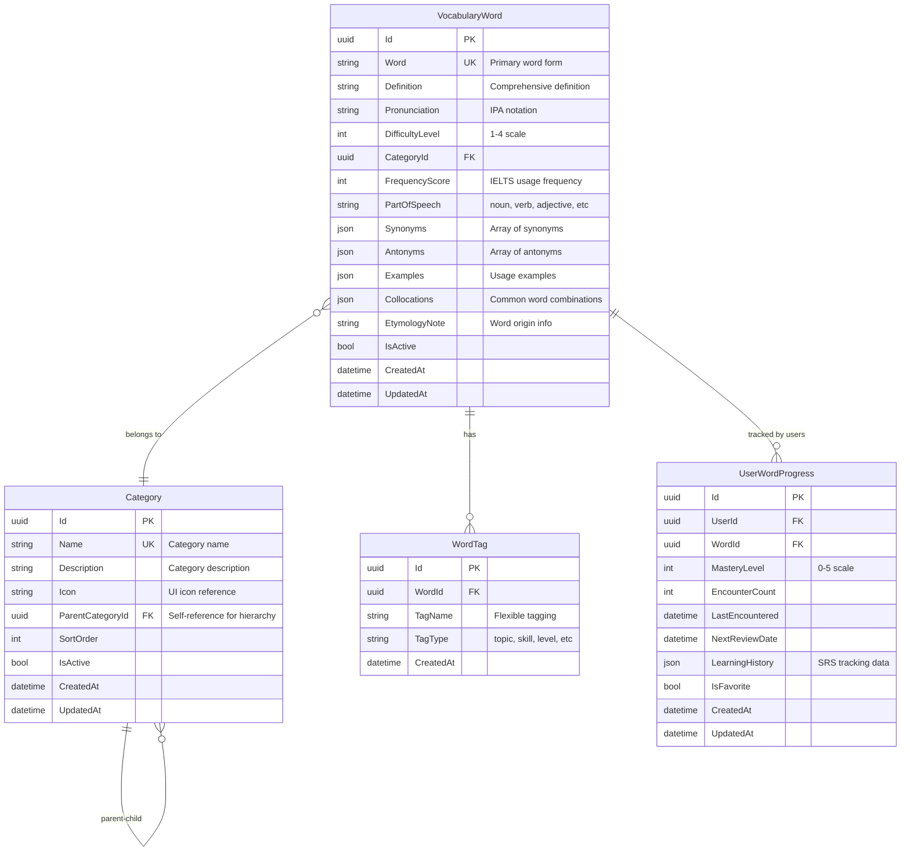
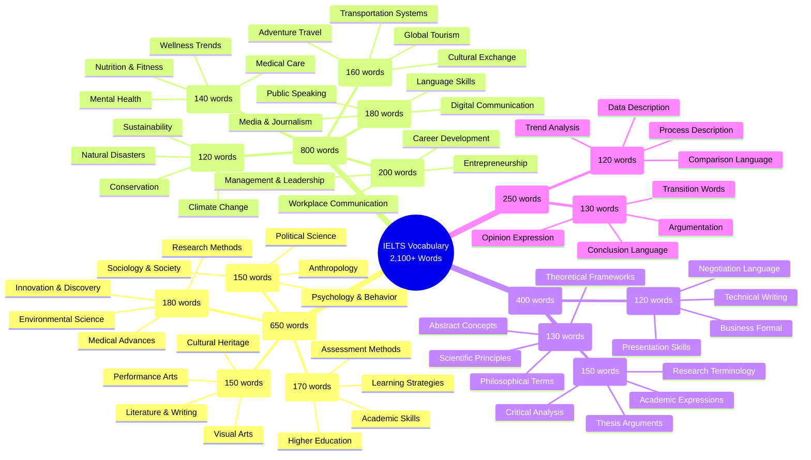
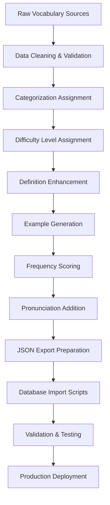

# StudyBridge: IELTS Vocabulary Database Seeding Plan

## 📋 Overview

This document outlines the comprehensive plan for seeding **2,100+ IELTS vocabulary words** into the StudyBridge PostgreSQL database. The vocabulary system is designed to support advanced language learning with categorized, difficulty-graded, and contextually rich word management.

## 🎯 Project Goals

### Primary Objectives
- **Seed 2,100+ vocabulary words** categorized by IELTS topics
- **Create hierarchical categorization** system for organized learning
- **Implement difficulty progression** from basic to advanced levels
- **Provide rich context** with definitions, examples, and usage patterns
- **Support spaced repetition** algorithm with frequency data
- **Enable pronunciation** guidance for speaking practice

### Success Metrics
- ✅ Complete vocabulary database with 2,100+ words
- ✅ Categorized into 15+ topic areas
- ✅ Difficulty levels (Easy, Medium, Hard, Expert)
- ✅ 3+ contextual examples per word
- ✅ Frequency scoring based on IELTS usage
- ✅ Pronunciation support (IPA phonetics)

---

## 🏗️ Database Architecture

### Domain Model Design



### Entity Framework Configuration

```csharp
// StudyBridge.Domain/Entities/VocabularyWord.cs
public class VocabularyWord : BaseAuditableEntity
{
    public string Word { get; set; } = string.Empty;
    public string Definition { get; set; } = string.Empty;
    public string Pronunciation { get; set; } = string.Empty;
    public DifficultyLevel Difficulty { get; set; }
    public Guid CategoryId { get; set; }
    public int FrequencyScore { get; set; }
    public PartOfSpeech PartOfSpeech { get; set; }
    public List<string> Synonyms { get; set; } = new();
    public List<string> Antonyms { get; set; } = new();
    public List<WordExample> Examples { get; set; } = new();
    public List<string> Collocations { get; set; } = new();
    public string EtymologyNote { get; set; } = string.Empty;
    
    // Navigation Properties
    public Category Category { get; set; } = null!;
    public ICollection<WordTag> Tags { get; set; } = new List<WordTag>();
    public ICollection<UserWordProgress> UserProgress { get; set; } = new List<UserWordProgress>();
}

// Supporting Enums
public enum DifficultyLevel
{
    Easy = 1,        // IELTS Band 5-6
    Medium = 2,      // IELTS Band 6-7
    Hard = 3,        // IELTS Band 7-8
    Expert = 4       // IELTS Band 8-9
}

public enum PartOfSpeech
{
    Noun, Verb, Adjective, Adverb, Preposition, 
    Conjunction, Interjection, Pronoun, Determiner, 
    Phrasal_Verb, Idiom, Collocation
}
```

---

## 📚 Content Structure & Categories

### IELTS Topic Categories (2,100+ words distributed)



### Difficulty Distribution Strategy

| **Difficulty Level** | **Word Count** | **IELTS Band** | **Learning Focus** |
|---------------------|---------------|----------------|-------------------|
| **Easy (1)**        | 630 words     | 5.0-6.0        | Foundation vocabulary, high-frequency words |
| **Medium (2)**      | 840 words     | 6.0-7.0        | Academic vocabulary, common collocations |
| **Hard (3)**        | 420 words     | 7.0-8.0        | Advanced academic, low-frequency specialist terms |
| **Expert (4)**      | 210 words     | 8.0-9.0        | Sophisticated vocabulary, idiomatic expressions |
| **Total**           | **2,100 words** | **5.0-9.0**    | Complete IELTS vocabulary spectrum |

---

## 🔧 Technical Implementation

### Database Schema Migration

```sql
-- Create Vocabulary Schema
CREATE SCHEMA IF NOT EXISTS vocabulary;

-- Categories Table
CREATE TABLE vocabulary.categories (
    id UUID PRIMARY KEY DEFAULT gen_random_uuid(),
    name VARCHAR(100) NOT NULL UNIQUE,
    description TEXT,
    icon VARCHAR(50),
    parent_category_id UUID REFERENCES vocabulary.categories(id),
    sort_order INTEGER DEFAULT 0,
    is_active BOOLEAN DEFAULT true,
    created_at TIMESTAMP DEFAULT CURRENT_TIMESTAMP,
    updated_at TIMESTAMP DEFAULT CURRENT_TIMESTAMP
);

-- Vocabulary Words Table
CREATE TABLE vocabulary.words (
    id UUID PRIMARY KEY DEFAULT gen_random_uuid(),
    word VARCHAR(100) NOT NULL UNIQUE,
    definition TEXT NOT NULL,
    pronunciation VARCHAR(200),
    difficulty_level INTEGER CHECK (difficulty_level BETWEEN 1 AND 4),
    category_id UUID NOT NULL REFERENCES vocabulary.categories(id),
    frequency_score INTEGER DEFAULT 0,
    part_of_speech VARCHAR(20),
    synonyms JSONB DEFAULT '[]',
    antonyms JSONB DEFAULT '[]',
    examples JSONB DEFAULT '[]',
    collocations JSONB DEFAULT '[]',
    etymology_note TEXT,
    is_active BOOLEAN DEFAULT true,
    created_at TIMESTAMP DEFAULT CURRENT_TIMESTAMP,
    updated_at TIMESTAMP DEFAULT CURRENT_TIMESTAMP
);

-- Word Tags for flexible categorization
CREATE TABLE vocabulary.word_tags (
    id UUID PRIMARY KEY DEFAULT gen_random_uuid(),
    word_id UUID NOT NULL REFERENCES vocabulary.words(id) ON DELETE CASCADE,
    tag_name VARCHAR(50) NOT NULL,
    tag_type VARCHAR(20) DEFAULT 'topic',
    created_at TIMESTAMP DEFAULT CURRENT_TIMESTAMP
);

-- User Learning Progress
CREATE TABLE vocabulary.user_word_progress (
    id UUID PRIMARY KEY DEFAULT gen_random_uuid(),
    user_id UUID NOT NULL, -- References users table
    word_id UUID NOT NULL REFERENCES vocabulary.words(id) ON DELETE CASCADE,
    mastery_level INTEGER DEFAULT 0 CHECK (mastery_level BETWEEN 0 AND 5),
    encounter_count INTEGER DEFAULT 0,
    last_encountered TIMESTAMP,
    next_review_date TIMESTAMP,
    learning_history JSONB DEFAULT '{}',
    is_favorite BOOLEAN DEFAULT false,
    created_at TIMESTAMP DEFAULT CURRENT_TIMESTAMP,
    updated_at TIMESTAMP DEFAULT CURRENT_TIMESTAMP,
    UNIQUE(user_id, word_id)
);

-- Indexes for performance
CREATE INDEX idx_words_category ON vocabulary.words(category_id);
CREATE INDEX idx_words_difficulty ON vocabulary.words(difficulty_level);
CREATE INDEX idx_words_frequency ON vocabulary.words(frequency_score DESC);
CREATE INDEX idx_words_active ON vocabulary.words(is_active);
CREATE INDEX idx_user_progress_user_id ON vocabulary.user_word_progress(user_id);
CREATE INDEX idx_user_progress_next_review ON vocabulary.user_word_progress(next_review_date);
```

### Data Seeding Strategy

#### Phase 1: Category Structure Setup
```csharp
// StudyBridge.Infrastructure/Data/VocabularySeeder.cs
public class VocabularySeeder
{
    public static async Task SeedCategoriesAsync(IApplicationDbContext context)
    {
        var rootCategories = new[]
        {
            new Category { Name = "Academic Topics", Description = "Advanced academic vocabulary", Icon = "pi-graduation-cap", SortOrder = 1 },
            new Category { Name = "General Topics", Description = "Everyday vocabulary for general use", Icon = "pi-globe", SortOrder = 2 },
            new Category { Name = "Advanced Vocabulary", Description = "High-level sophisticated vocabulary", Icon = "pi-star", SortOrder = 3 },
            new Category { Name = "Functional Language", Description = "Task-specific IELTS language", Icon = "pi-cogs", SortOrder = 4 }
        };

        foreach (var category in rootCategories)
        {
            if (!await context.Categories.AnyAsync(c => c.Name == category.Name))
            {
                await context.Categories.AddAsync(category);
            }
        }
        
        await context.SaveChangesAsync();
        
        // Create subcategories
        await SeedSubCategoriesAsync(context, rootCategories);
    }
}
```

#### Phase 2: Word Data Import System
```csharp
public class WordImportService
{
    public async Task<ImportResult> ImportWordsFromJsonAsync(string jsonFilePath)
    {
        var wordData = await File.ReadAllTextAsync(jsonFilePath);
        var words = JsonSerializer.Deserialize<VocabularyWordDto[]>(wordData);
        
        var importResult = new ImportResult();
        
        foreach (var wordDto in words)
        {
            try
            {
                var vocabularyWord = MapToEntity(wordDto);
                await ValidateAndSaveWordAsync(vocabularyWord);
                importResult.SuccessCount++;
            }
            catch (Exception ex)
            {
                importResult.Errors.Add($"Word '{wordDto.Word}': {ex.Message}");
            }
        }
        
        return importResult;
    }
}
```

---

## 📊 Data Sources & Preparation

### Primary Data Sources

1. **Cambridge IELTS Vocabulary Lists**
   - Official IELTS vocabulary recommendations
   - Academic Word List (AWL) integration
   - Topic-specific vocabulary sets

2. **Oxford Academic Vocabulary**
   - High-frequency academic words
   - Subject-specific terminology
   - Collocations and usage patterns

3. **IELTS Preparation Materials**
   - Official Cambridge materials
   - Academic writing vocabulary
   - Speaking test vocabulary

4. **Frequency Analysis Data**
   - Corpus-based frequency scoring
   - IELTS test occurrence analysis
   - Academic text frequency data

### Data Preparation Process



### Sample Data Structure

```json
{
  "vocabulary_words": [
    {
      "word": "accomplish",
      "definition": "To complete successfully; to achieve a goal or task",
      "pronunciation": "/əˈkʌmplɪʃ/",
      "difficulty_level": 2,
      "category": "Academic Topics > General Academic",
      "frequency_score": 85,
      "part_of_speech": "verb",
      "synonyms": ["achieve", "complete", "fulfill", "realize"],
      "antonyms": ["fail", "abandon", "neglect"],
      "examples": [
        {
          "sentence": "Students need to accomplish their assignments before the deadline.",
          "context": "Academic writing",
          "level": "intermediate"
        },
        {
          "sentence": "The research team accomplished their objectives within the allocated timeframe.",
          "context": "Research context",
          "level": "advanced"
        },
        {
          "sentence": "To accomplish success in IELTS, consistent practice is essential.",
          "context": "Test preparation",
          "level": "intermediate"
        }
      ],
      "collocations": ["accomplish goals", "accomplish tasks", "accomplish objectives", "successfully accomplish"],
      "etymology_note": "From Old French 'acompliss-', from 'acomplir' meaning 'to complete'",
      "tags": ["academic", "formal", "achievement", "goals"]
    }
  ]
}
```

---

## 🚀 Implementation Roadmap

### Phase 1: Foundation (Weeks 1-2)
**Deliverables:**
- ✅ Database schema design and migration scripts
- ✅ Entity models and configurations
- ✅ Category hierarchy structure (15+ categories)
- ✅ Data import infrastructure

**Technical Tasks:**
- Create vocabulary module in `StudyBridge.VocabularyManagement`
- Design and implement domain entities
- Create EF Core configurations
- Build category seeding system

### Phase 2: Data Preparation (Weeks 3-4)
**Deliverables:**
- ✅ Clean, categorized vocabulary dataset (2,100+ words)
- ✅ JSON import format specification
- ✅ Data validation rules and scripts
- ✅ Frequency scoring algorithm

**Content Tasks:**
- Compile vocabulary from multiple IELTS sources
- Assign difficulty levels and categories
- Generate contextual examples
- Create pronunciation guides (IPA notation)
- Validate data consistency and completeness

### Phase 3: Import System (Week 5)
**Deliverables:**
- ✅ Automated import scripts
- ✅ Data validation and error handling
- ✅ Progress tracking and reporting
- ✅ Rollback capabilities

**Technical Implementation:**
```csharp
// CQRS Commands for vocabulary management
public static class ImportVocabulary
{
    public class Command : ICommand<Response>
    {
        public string ImportFilePath { get; init; } = string.Empty;
        public bool ValidateOnly { get; init; } = false;
        public bool OverwriteExisting { get; init; } = false;
    }

    public class Response
    {
        public int TotalWords { get; init; }
        public int SuccessfulImports { get; init; }
        public int SkippedWords { get; init; }
        public List<string> Errors { get; init; } = new();
        public TimeSpan ImportDuration { get; init; }
    }
}
```

### Phase 4: API Development (Week 6)
**Deliverables:**
- ✅ Vocabulary browsing endpoints
- ✅ Search and filtering capabilities
- ✅ User progress tracking APIs
- ✅ Admin management interfaces

**API Endpoints:**
```csharp
[ApiController]
[Route("api/v1/vocabulary")]
public class VocabularyController : BaseController
{
    [HttpGet("words")]
    public async Task<IActionResult> GetWords([FromQuery] GetVocabularyWords.Query query)
    
    [HttpGet("words/{id}")]
    public async Task<IActionResult> GetWordById(Guid id)
    
    [HttpGet("categories")]
    public async Task<IActionResult> GetCategories()
    
    [HttpPost("progress")]
    public async Task<IActionResult> UpdateProgress([FromBody] UpdateWordProgress.Command command)
    
    [HttpGet("user-progress")]
    [Authorize]
    public async Task<IActionResult> GetUserProgress([FromQuery] GetUserProgress.Query query)
}
```

### Phase 5: Frontend Integration (Week 7)
**Deliverables:**
- ✅ Vocabulary browsing interface
- ✅ Learning session components
- ✅ Progress tracking dashboard
- ✅ Search and filtering UI

**Angular Components:**
- `VocabularyBrowseComponent` - Word browsing and filtering
- `VocabularyDetailComponent` - Individual word details
- `LearningSessionComponent` - Interactive learning interface
- `ProgressDashboardComponent` - User learning analytics

### Phase 6: Testing & Optimization (Week 8)
**Deliverables:**
- ✅ Comprehensive unit tests (90%+ coverage)
- ✅ Integration tests for import process
- ✅ Performance optimization
- ✅ Load testing with full dataset

---

## 🎯 Success Metrics & KPIs

### Quantitative Metrics
- **Database Performance**: < 100ms query response time for word searches
- **Import Success Rate**: 99%+ successful word imports
- **Data Completeness**: 100% words have definitions, 95% have examples
- **User Engagement**: 70%+ of words accessed within first month

### Qualitative Metrics
- **Content Accuracy**: Expert review and validation
- **Educational Value**: Alignment with IELTS requirements
- **User Experience**: Intuitive vocabulary browsing
- **System Reliability**: 99.9% uptime during vocabulary operations

---

## 🔒 Data Governance & Quality

### Data Validation Rules
```csharp
public class VocabularyWordValidator : AbstractValidator<VocabularyWord>
{
    public VocabularyWordValidator()
    {
        RuleFor(w => w.Word)
            .NotEmpty()
            .Length(1, 100)
            .Matches(@"^[a-zA-Z\s\-']+$"); // Letters, spaces, hyphens, apostrophes only

        RuleFor(w => w.Definition)
            .NotEmpty()
            .Length(10, 500);

        RuleFor(w => w.Examples)
            .Must(examples => examples.Count >= 2)
            .WithMessage("Each word must have at least 2 examples");

        RuleFor(w => w.FrequencyScore)
            .InclusiveBetween(1, 100);

        RuleFor(w => w.Difficulty)
            .IsInEnum();
    }
}
```

### Quality Assurance Process
1. **Automated Validation**: Schema and content validation during import
2. **Expert Review**: Educational content review by IELTS specialists
3. **User Feedback**: Community-driven quality improvements
4. **Regular Audits**: Quarterly content accuracy reviews
5. **Version Control**: Track all vocabulary changes and updates

---

## 📈 Future Enhancements

### Short-term Improvements (Q1 2026)
- **Audio Pronunciation**: Native speaker audio files
- **Visual Context**: Images for concrete nouns
- **Usage Analytics**: Track most/least studied words
- **Adaptive Learning**: AI-powered difficulty adjustment

### Long-term Vision (2026+)
- **Multi-language Support**: Vocabulary in native languages
- **Advanced SRS**: Machine learning-powered spaced repetition
- **Contextual Learning**: Sentence completion exercises
- **Collaborative Features**: User-generated content and reviews

---

## 🛠️ Development Resources

### Required Team & Skills
- **Backend Developer** (1): .NET Core, PostgreSQL, Entity Framework
- **Frontend Developer** (1): Angular, TypeScript, PrimeNG
- **Content Specialist** (1): IELTS expertise, vocabulary curation
- **DevOps Engineer** (0.5): Database management, deployment

### Technology Stack
- **Database**: PostgreSQL 14+ with JSONB support
- **Backend**: .NET 8, Entity Framework Core, CQRS pattern
- **Frontend**: Angular 20, PrimeNG, TypeScript
- **Testing**: xUnit, Moq, FluentAssertions
- **Deployment**: Docker, CI/CD pipelines

### Estimated Timeline
- **Total Duration**: 8 weeks
- **Development**: 6 weeks
- **Testing & QA**: 1 week  
- **Deployment**: 1 week
- **Effort**: ~3 FTE (Full-Time Equivalent) resources

---

## 📝 Conclusion

The StudyBridge vocabulary seeding project represents a comprehensive approach to creating a world-class IELTS vocabulary learning system. With careful planning, robust technical implementation, and focus on educational quality, this system will provide learners with an exceptional vocabulary building experience.

The phased approach ensures manageable development while maintaining high quality standards. The emphasis on data quality, user experience, and scalable architecture positions StudyBridge as a leading platform for IELTS vocabulary preparation.

**Next Steps:**
1. **Project Approval**: Stakeholder review and approval
2. **Resource Allocation**: Team assignment and timeline confirmation  
3. **Development Kickoff**: Phase 1 implementation start
4. **Regular Reviews**: Weekly progress monitoring and adjustments

---

*Document Version: 1.0*  
*Last Updated: September 28, 2025*  
*Next Review: Upon Phase 1 Completion*